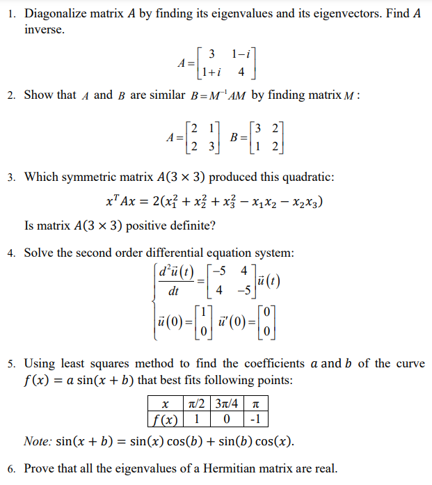
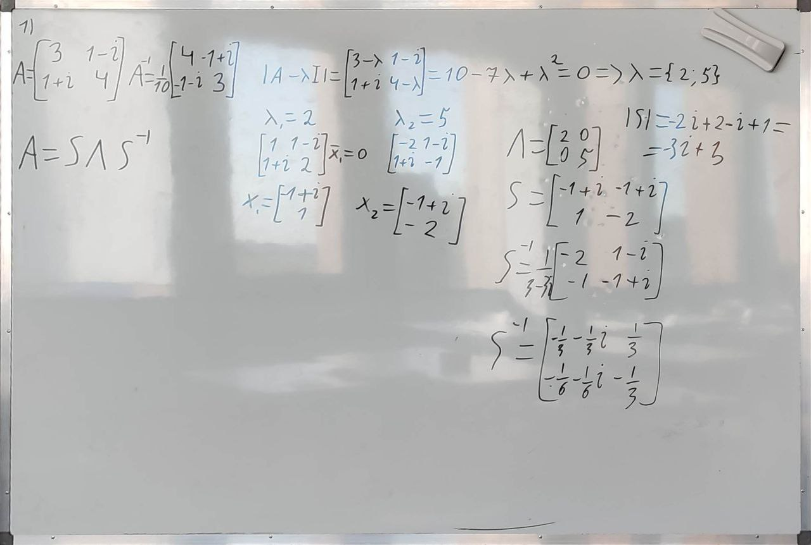
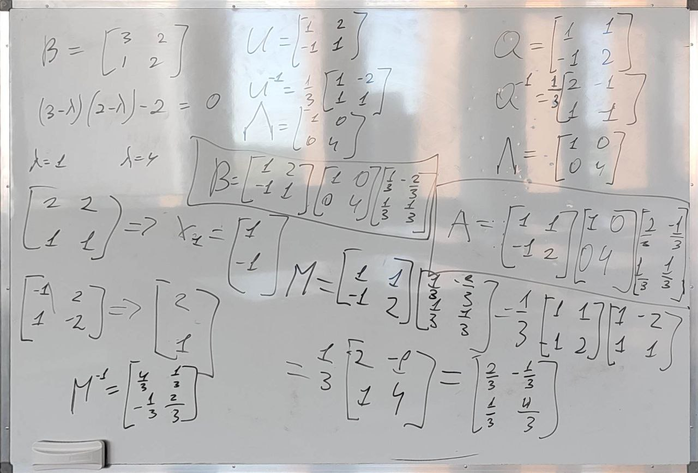
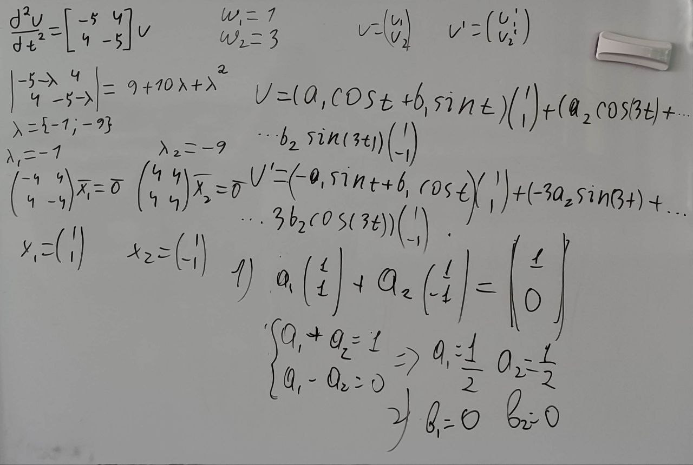
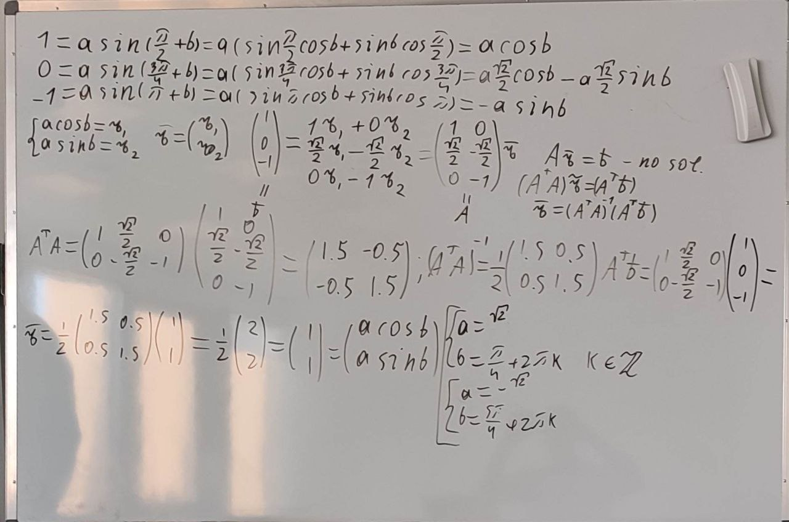

# AGLA 2 Final preparation

## TOC

- [AGLA 2 Final preparation](#agla-2-final-preparation)
  - [TOC](#toc)
  - [Notes From @kupamonke](#notes-from-kupamonke)
    - [Нахождение обратной матрицы 2x2](#нахождение-обратной-матрицы-2x2)
    - [Нахождение обратной матрицы 3x3](#нахождение-обратной-матрицы-3x3)
    - [Нахождение собственный значений и векторов (**Eigenvalues and Eigenvectors**)](#нахождение-собственный-значений-и-векторов-eigenvalues-and-eigenvectors)
    - [1 задание](#1-задание)
    - [2 задание](#2-задание)
    - [3 задание](#3-задание)
    - [4 задание](#4-задание)
    - [5 задание](#5-задание)
    - [6 задание](#6-задание)
  - [Kholodov Lecture Notes from @kupamonke](#kholodov-lecture-notes-from-kupamonke)
  - [MIT Lecture notes from @kupamonke](#mit-lecture-notes-from-kupamonke)

## Notes From @kupamonke

### Нахождение обратной матрицы 2x2

$A = \begin{bmatrix}
  a & b \\\
  c & d
\end{bmatrix}$

$A^{-1} = \frac{1}{|A|}\begin{bmatrix}
  d & -b \\\
  -c & a
\end{bmatrix}$

### Нахождение обратной матрицы 3x3

$A = \begin{bmatrix}
a & b & c \\\
d & e & f \\\
g & h & i
\end{bmatrix}$

$A^{-1} = \frac{1}{|A|} \bar A$

$\bar A = {(A^c_{+-})}^T$

$A_{+-}^c$ - матрица дополнительных миноров (кофакторов) $A_{+-}^c[i][j]$ это **определитель матрицы, полученной из исходной вычеркиванием строки $i$ и столбца $j$, при этом если $(i+j)\%2 = 1$ то мы умножаем полученный определитель на $-1$**.

### Нахождение собственный значений и векторов (**Eigenvalues and Eigenvectors**)

**Eigenvectors $\vec x :$ $A\vec x = \lambda \vec x$**

**Eigenvalues $\lambda \in \mathbb C: A\vec x = \lambda \vec x$**

$|A| = 0 ⇒ \lambda = 0$ - eigenvalue

$\sum \lambda = Tr(A)$

$\prod \lambda = |A|$

$A\vec x = \lambda \vec x \iff (A - \lambda I)\vec x = 0 ⇒ |A - \lambda I| = 0$
$I$ - identity matrix

Из $|A - \lambda I| = 0$ находим собственные значения, зная их из $(A - \lambda I)\vec x = 0$ находим собсвенные вектора для каждого собственного значения $(x_i = N(A-\lambda_i I))$

### 1 задание

$S = \begin{bmatrix} x_1 & \ldots & x_n \end{bmatrix}$

$AS = S\Lambda , \Lambda = \begin{bmatrix}
\lambda_1 & 0 & 0 \\\
0 & \ddots & 0 \\\
0 & 0 & \lambda_n
\end{bmatrix}$

$S^{-1}AS = \Lambda$

$Ax = \lambda x ⇒ A^2 x = A\lambda x = \lambda Ax = \lambda^2 x$

$A^2 = S \Lambda^2 S^{-1}$

$A^k = S\Lambda^k S^{-1}$

### 2 задание

Диагонализируем матрицы A и B
$A = Q\Lambda Q^{-1}$
$B = S \Lambda S^{-1}$
$B = M^{-1}AM$
$S \Lambda S^{-1} = M^{-1} Q\Lambda Q^{-1} M ⇒ S = M^{-1}Q ⇒ M = QS^{-1}$

$M = QS^{-1}$

### 3 задание

$A^T = A ⇒$
$A = \begin{bmatrix}
a & b & c \\\
b & d & e \\\
c & e & f
\end{bmatrix}$

Эту матрицу мы просто подставляем в уравнение и брутфорсом распиываем его

Матрица позитивна если выполнгено хотя бы одно из условий

1. $\lambda > 0$
2. subdeterminants > 0
3. all pivots > 0
4. $\forall x \neq \vec 0 x^T A x > 0$

### 4 задание

$\frac{d^2u}{dt^2} = A u$

$A ⇒ \{\lambda_1 … \lambda_n \} , \{x_1 … x_n \}$

$\omega_i = \sqrt{-\lambda_i}$

$u = (c_1 e^{i\omega_1 t} + \alpha_1 e^{-\omega_1t})\cdot x_1 + …$

$u = (a_1 cos(\omega_1 t) + b_1 sin(\omega_1 t))x_1 + …$

$\forall i$ $a_i, b_i, c_i, \alpha_i \in \mathbb R$

### 5 задание

$Ax = b$ - no sol
$A^TA\bar x = A^Tb$ - least squares approximation

В этом задании вектор x будет равен
$\begin{bmatrix}
a\cdot sin(b) \\\
a\cdot cos(b)
\end{bmatrix}$

### 6 задание

<https://yutsumura.com/eigenvalues-of-a-hermitian-matrix-are-real-numbers/>

## Kholodov Lecture Notes from @kupamonke

[Link to Kholodov Notes](Kholodov.md)

## MIT Lecture notes from @kupamonke

[Link to MIT Notes](MIT/MIT.md)

[<kbd> <- Return </kbd>](AGLA2.md)
