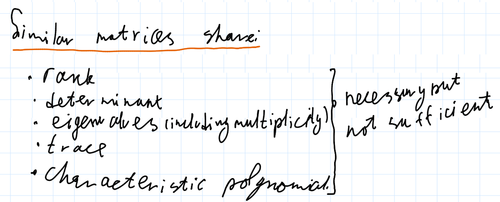
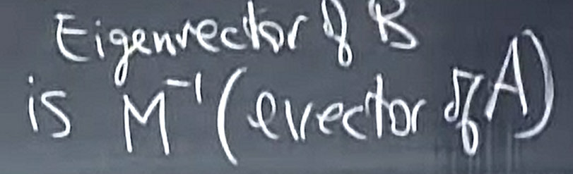
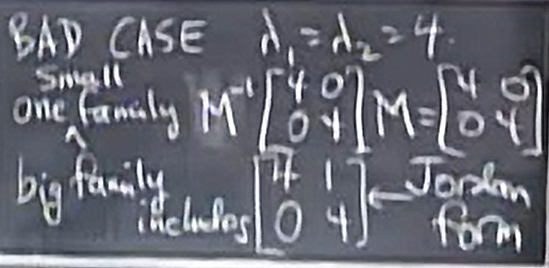

# 28. Similar Matrices and Jordan Form

$A$ and $B$ simular $\iff \exists M : B = M^{-1} A M$

positive define $\iff \forall x \neq \vec 0 x^T A x > 0$

Матрица позитивна если выполнгено хотя бы одно условие

1. $\lambda > 0$
2. subdeterminants > 0
3. all pivots > 0
4. $\forall x \neq \vec 0 x^T A x > 0$

$A^T \times A$ is positive define (or at least $\forall x \neq \vec 0 x^T A x \geq 0$)

$S^{-1} A S = \Lambda$ so $A$ and $\Lambda$ are simular

[<kbd> <- Return </kbd>](MIT.md)
