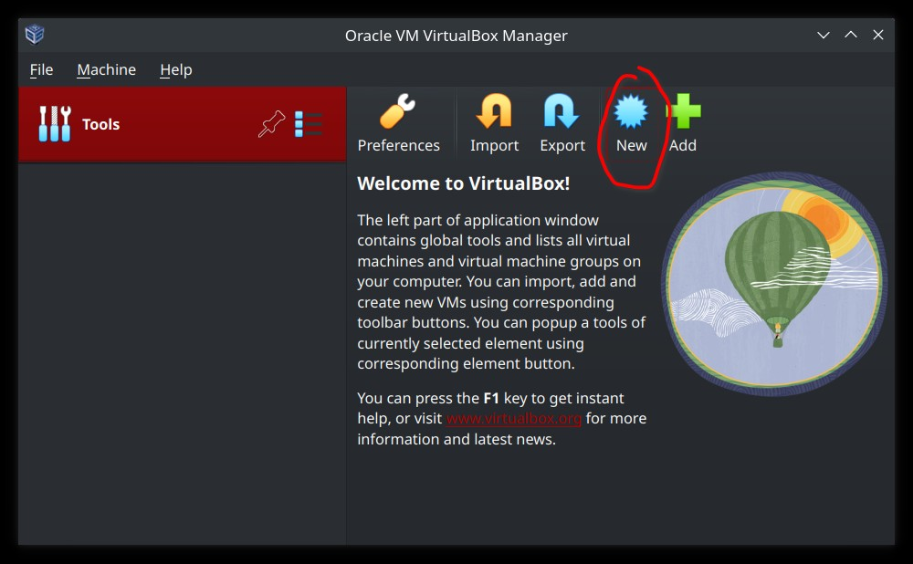
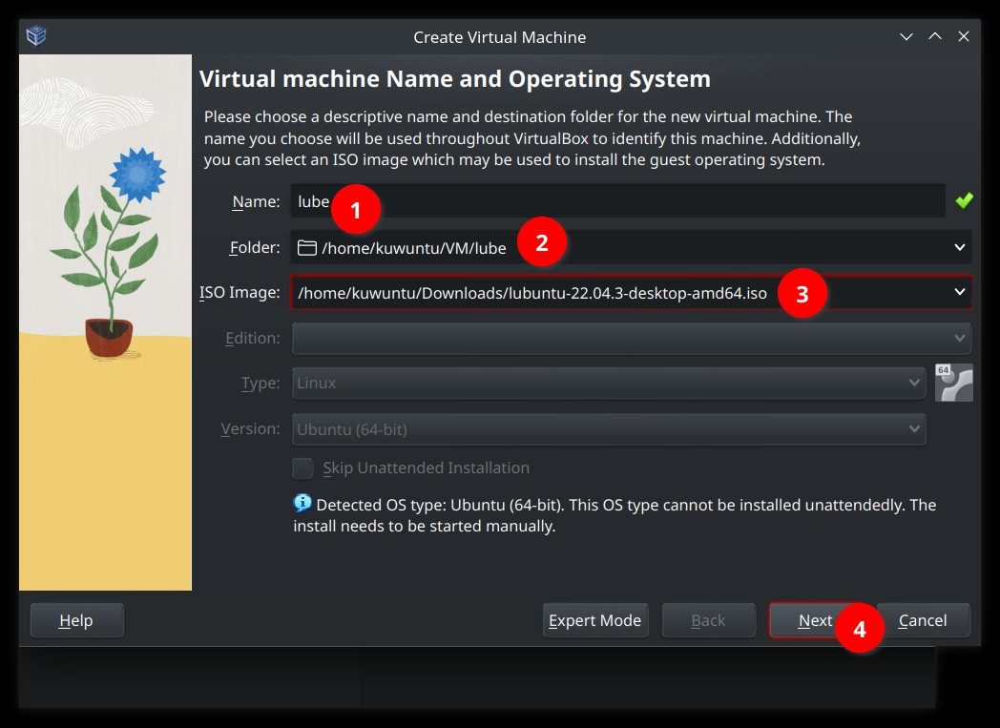
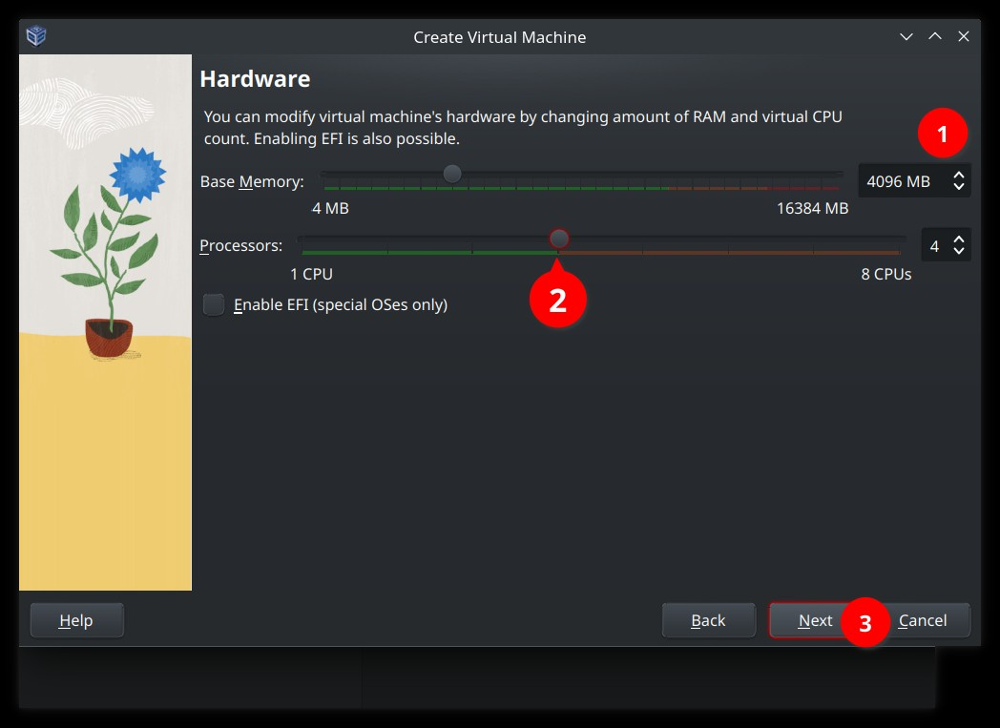
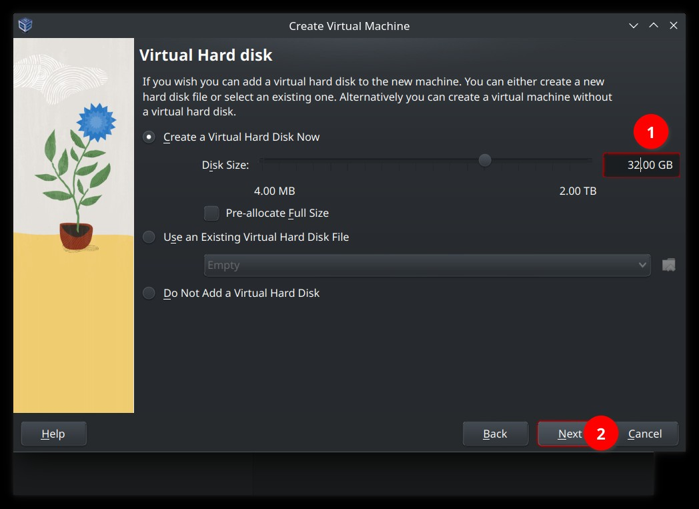
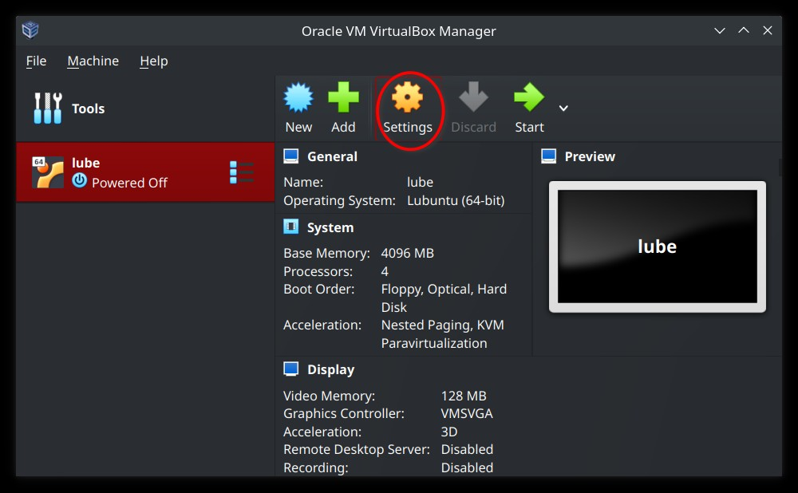
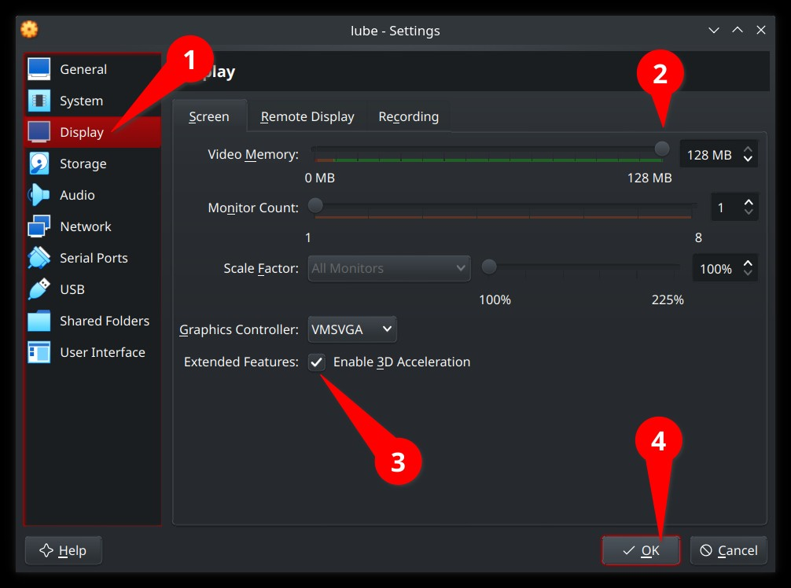

# How to create a Virtual Machine (VM) in VirtualBox

## TOC

- [How to create a Virtual Machine (VM) in VirtualBox](#how-to-create-a-virtual-machine-vm-in-virtualbox)
  - [TOC](#toc)
  - [Step 1: Have VirtualBox installed](#step-1-have-virtualbox-installed)
  - [Step 2: Choose and download the distro image](#step-2-choose-and-download-the-distro-image)
  - [Step 3: Create the virtual machine](#step-3-create-the-virtual-machine)
  - [Step 4: Launch the VM](#step-4-launch-the-vm)
  - [Step 5: Installing the OS](#step-5-installing-the-os)
  - [End of the guide](#end-of-the-guide)

## Step 1: Have [VirtualBox](https://www.virtualbox.org/wiki/Downloads) installed

## Step 2: Choose and download the distro image

I will be using [`lubuntu`](https://lubuntu.me) (Lightweight Ubuntu) for this purpose. But you can install any distro that you want (I will be using `apt` in the lab 1 preparation, so I recommend you to use the Debian based ones)

Follow [this page](https://manual.lubuntu.me/stable/1/1.1/retrieving_the_image.html) if you are unsure of what version do you need.

## Step 3: Create the virtual machine

Launch the VirtualBox on your host machine, and follow:

Also, you can additionally increase the video memory and enable 3D acceleration for your VM:

## Step 4: Launch the VM

Select the VM and press `Start` button

## Step 5: Installing the OS

Follow [this guide](https://manual.lubuntu.me/stable/1/1.3/installation.html) if you are installing `lubuntu`, and if you are using other distro, just search for `[your distro name] installation`.

## End of the guide

[<kbd> <- Return </kbd>](Lab1Solution.md)
