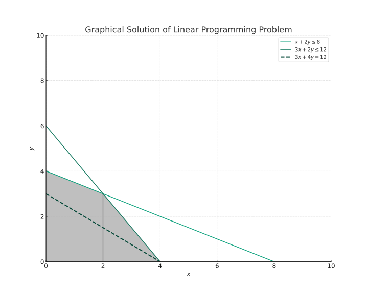

# Graphical Linear Problem Solution

## TOC

- [Graphical Linear Problem Solution](#graphical-linear-problem-solution)
  - [TOC](#toc)
  - [ChatGPT 4 Explanation](#chatgpt-4-explanation)
  - [ChatGPT 4 Solution Example](#chatgpt-4-solution-example)

## ChatGPT 4 Explanation

The graphical method is a way to solve linear programming problems when there are two variables. This method allows us to visualize the feasible region and identify the optimal solution by plotting the constraints and the objective function on a graph.

Here's a step-by-step process to solve a linear programming problem graphically:

1. **Problem Formulation**:
   First, you need to have the linear programming problem formulated. It will generally look like this:

   Maximize (or Minimize) $Z = c_1x_1 + c_2x_2$

   Subject to:

   $a_{11}x_1 + a_{12}x_2 \leq b_1\\\
   a_{21}x_1 + a_{22}x_2 \leq b_2\\\
   ...\\\
   x_1, x_2 \geq 0$
2. **Graph the Constraints**:

   - Draw the coordinate axes for $x_1$ and $x_2$.
   - For each inequality, treat it as an equation to plot a line.
   - Determine which side of the line is the feasible region (you can do this by testing a point; if it satisfies the inequality, then that side of the line is the feasible region).
3. **Identify the Feasible Region**:
   This is the region where all the constraints overlap. It can be a bounded area (like a polygon) or unbounded. If the problem has no feasible region, then it has no solution.
4. **Plot the Objective Function**:

   - Choose a value for $Z$ (it can be any value that will fit comfortably on your graph).
   - Rewrite the objective function in terms of one of the variables (e.g., $x_2 = \frac{Z - c_1x_1}{c_2}$).
   - Plot this line on the graph.
5. **Find the Optimal Solution**:

   - If you're maximizing, move the objective function line outward (increasing $Z$) from the feasible region until the last point it touches.
   - If you're minimizing, move it inward (decreasing $Z$) until the first point it touches.
   - The last (or first) point of the feasible region that the objective function touches is the optimal solution.
6. **Check for Multiple Solutions**:
   If the objective function line is parallel to one side of the feasible region, there may be multiple optimal solutions (any point on that segment is optimal).
7. **Report the Solution**:
   Identify the coordinates of the optimal point(s) and the maximum (or minimum) value of the objective function at that point.

## ChatGPT 4 Solution Example

Let's consider a simple linear programming problem.

**Problem Statement**:
Maximize $Z = 3x + 4y$

Subject to:

1. $x + 2y \leq 8$
2. $3x + 2y \leq 12$
3. $x, y \geq 0$

**Solution**:

1. **Graph the Constraints**:
   To do this, we'll first plot each inequality as if it were an equation (equality) and then shade the feasible region.

For the first constraint $x + 2y = 8$:

- When $x = 0$, $y = 4$
- When $y = 0$, $x = 8$

For the second constraint $3x + 2y = 12$:

- When $x = 0$, $y = 6$
- When $y = 0$, $x = 4$

2. **Identify the Feasible Region**:

We'll shade the area which satisfies all the inequalities. This will be the area below both lines (since they are both "less than or equal to" inequalities) and in the first quadrant (because $x, y \geq 0$).

3. **Plot the Objective Function**:
   We'll take a random value for $Z$ to plot the objective function. Let's choose $Z = 12$ for simplicity.

From $Z = 3x + 4y = 12$:

- When $x = 0$, $y = 3$
- When $y = 0$, $x = 4$

We'll plot this line.

4. **Find the Optimal Solution**:

Since we're maximizing, we'll move the line for the objective function outward from the feasible region to find the last point it touches.

Let's visualize these steps graphically.

```python
import numpy as np
import matplotlib.pyplot as plt

# Define the inequalities
x = np.linspace(0, 10, 400)

y1 = (8 - x) / 2
y2 = (12 - 3*x) / 2

plt.figure(figsize=(10,8))

# Plot the inequalities
plt.plot(x, y1, label=r'$x + 2y \leq 8$')
plt.fill_between(x, 0, y1, where=(y1<=y2), color='gray', alpha=0.5)

plt.plot(x, y2, label=r'$3x + 2y \leq 12$')
plt.fill_between(x, 0, y2, where=(y2<=y1), color='gray', alpha=0.5)

# Plot the objective function
y_obj = (12 - 3*x) / 4
plt.plot(x, y_obj, '--', label=r'$3x + 4y = 12$', linewidth=2)

plt.xlim((0, 10))
plt.ylim((0, 10))
plt.xlabel(r'$x$')
plt.ylabel(r'$y$')
plt.axhline(0, color='black',linewidth=0.5)
plt.axvline(0, color='black',linewidth=0.5)
plt.grid(True, which='both')
plt.legend()
plt.title('Graphical Solution of Linear Programming Problem')
plt.saveplot
plt.show()
```



Here's the graphical representation:

1. The shaded region represents the feasible region defined by the constraints.
2. The dashed line represents the objective function for $Z = 12$.

As we are aiming to maximize $Z$, we would move this dashed line upwards (while keeping its slope constant) until it just touches the feasible region.

To find the optimal solution:

- Identify the intersection points of the constraint lines within the feasible region.
- Calculate the value of $Z$ at each of these intersection points.
- The point where $Z$ is maximized will be our optimal solution.

Let's calculate the $Z$ values for these intersection points.

```python
# Intersection points within the feasible region
intersection_points = [
    (0, 4),  # Intersection with y-axis for the first constraint
    (4, 0),  # Intersection with x-axis for the second constraint
    (2, 3)   # Intersection of the two constraint lines
]

# Calculate Z values for each intersection point
z_values = [3*x + 4*y for x, y in intersection_points]

optimal_point = intersection_points[np.argmax(z_values)]
optimal_value = max(z_values)

optimal_point, optimal_value
```

```txt
RESULT
((2, 3), 18)
```

The optimal solution occurs at the point $(x, y) = (2, 3)$ with a maximum objective function value of $Z = 18$.

This means that to maximize $Z = 3x + 4y$ subject to the given constraints, we should choose $x = 2$ and $y = 3$.

The graphical method is a powerful tool for visualizing and understanding the solution to linear programming problems, especially when there are only two variables. For problems with more than two variables, however, we would need to use other methods, such as the Simplex method or interior point methods.

[<kbd><br><- Return<br></kbd>](Optimization.md)
