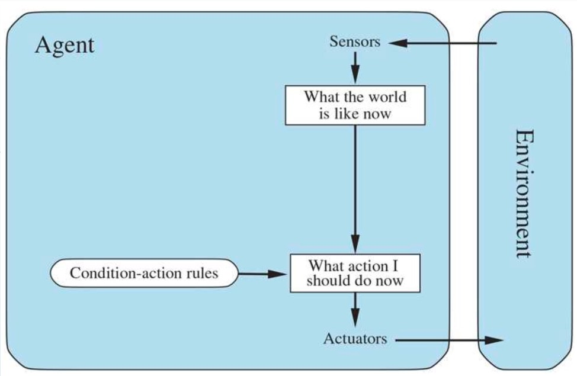
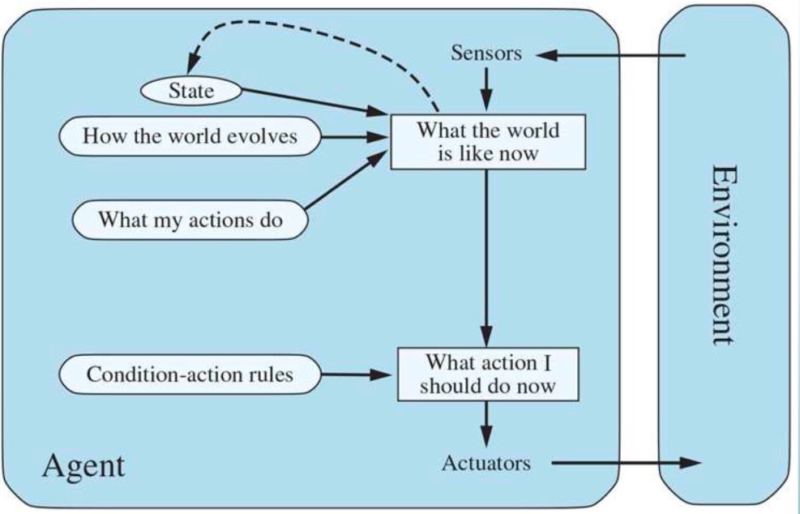

# Philosophy II AI

## Week 3: Agents

### Agent definition

- Agent is anything which:
  - Lives in an environment
  - Can perceive the environment via its sensors
  - Can act upon the environment via its actuators
- Agents also have memory of the current and past perceptions of the environment
  - Percept – the current state
  - Percept Sequence – the complete history of Percepts

> **Important**
> For Each possible percept sequence, a rational agent should select an action that is expected to maximize its performance measure, given the evidence provided by the percept sequence and whatever built-in knowledge the agent has.

The action a rational agent takes depends on:

- the preferences of the agent
- the agent's information of its environment, which may come from past experiences
- the actions, duties and obligations available to the agent
- the estimated or actual benefits and the chances of success of the actions.

> **Important**
> PEAS – Performance Measure, Environment, Actuators, Sensors.

### Properties of the Environment

- Fully Observable v. Partially Observable
- Single v. Multiple Agent
- Deterministic v. Stochastic
- Episodic v. Sequential
- Static v. Dynamic
- Discrete v. Continuous
- Known v. Unknown

Worst Case:
> An environment which is partially observable, multiagent, stochastic, sequential, dynamic, continuous, and unknown.

### Types of Agents

1. Simple reflex agents
    - 
    - Only current percept matters
    - Work only in fully observable environment
    - Too many condition-action rules may be required
2. Model-based reflex agents
    - 
    - Work better in partially observable environment because of keeping track of the world
    - Internal state exists
3. Goal-based agents
    - 
    - More flexible than previous agent types
    - Goal replacement does not entail rewriting of all the rules
    - May be hard to choose between multiple goals
4. Utility-based agents
    - 
    - Allow to maximize the “happiness” of the agent
    - Allows to find the tradeoff between the conflicting goals
5. Learning agents
    - 

### Types of reasoning

Deductive Reasoning: Using general statements to draw specific conclusions with certainty.

Inductive Reasoning: a method of drawing conclusions by going from the specific to the general. (bottom-up approach)
