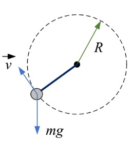
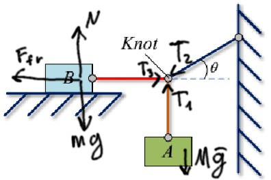

# Physics I Homework 2

By Nesterov Danil <d.nesterov@innopolis.university>

---

## EX 2

<table>
<tr>
<th>Given</th>
<th>Figure</th>
</tr>
<tr>
<td>

$m=0.25kg\\
R=0.7m\\
T_{max}=30N\\
g=9.8m/s^2\\
1)\vec{P_{T_{max}}}-?\\
2)u_{max}-?$
</td>
<td>

</td>
</tr>
</table>

### 2.1

*Answer:* At the lowest point.

$\begin{cases}
    u=const\\
    R=const\\
    m=const
\end{cases}=>
\begin{cases}
    ma_c=const\\
    mg=const
\end{cases}$

$\phi$ is the angle between *string* and *string at the lowest point*

$T-mg\cos(\phi)=ma_c\\
T=c_1+c_2\cos(\phi)$

we can reach $T_{max}$ if $\cos(\phi)=0<=>\phi=2\pi k, k\in R$

$\phi=2\pi k, k\in R$ (lowest point)

---

## EX 4

<table>
<tr>
<th>Given</th>
<th>Figure</th>
</tr>
<tr>
<td>

$m=50kg\\
\mu=0.25\\
\theta=30\degree\\
T_2$ is horizontal$\\
g=9.8m/s^2\\
M-?$
</td>
<td>

</td>
</tr>
</table>

$\begin{cases}
    mg=N\\
    F_{fr}=\mu N => F_{fr} = \mu mg\\
    T_3=F_{fr}\\
    Mg=T_1\\
    T_2 \sin(30 \degree)=T_1\\
    T_2 \cos(30 \degree)=T_3
\end{cases}$

$\begin{cases}
    T_2=\frac{Mg}{\sin(30\degree)}\\
    T_2=\frac{\mu mg}{\cos(30\degree)}
\end{cases}$

$M\not{g}\cos(30\degree)=\mu m\not{g}\sin(30\degree)$

$M=\frac{\mu m\sin(30\degree)}{\cos(30\degree)}$

$M=\frac{0.25\times 50kg\times \not{\frac{1}{2}}}{\sqrt{3}/\not{2}}=\frac{12.5\sqrt{3}}{3}kg=\frac{25\sqrt{3}}{6}kg\approx 7.2kg$

$Answer: 7.2kg$
