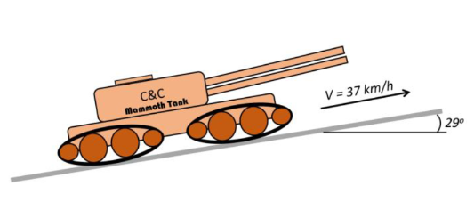

<!--Document-->
# Physics I Homework 3

By Nesterov Danil <d.nesterov@innopolis.university>

---

## EX 1

<table>
<tr>
<th>Given</th>
<th>Figure</th>
</tr>
<tr>
<td>

$m = 80kg\\
H = 70m\\
x = 0.5m\\
k - ?\\
v_i - ?$

</td>
<td>

</td>
</tr>
</table>

designations:

$W\text{ - full energy}\\
E_0\text{ - initial energy}\\
E_1\text{ - energy at maximium height}\\
X\text{ - spring compression}$

Considering 0 resistance forces, according to the law of conservation of energy:

$W = E_0 = E_1$

It is obvious (*"You should know it from school"*) that in the initial and final positions the character's speed is 0. Let's take the initial position potential energy as 0:

$E_0 = \frac{kx^2}{2}\\
E_1 = mg(H+x)\\$

Let’s answer on **Q1** using system below

$\begin{cases}
E_0 = \frac{kx^2}{2}\\E_1 = mg(H+x)\\W = E_0 = E_1
\end{cases}\\
\begin{cases}
W = \frac{kx^2}{2} \\
W=mg(H+x)\\
\end{cases}\\
k = \frac{2mg(H+x)}{x^2} = \frac{2\cdot55272(J)}{(0.5m)^2}=442176\frac{N}{m}=442\frac{KN}{m}$

When spring begin to unclench, the difference of spring energy is more than difference of the potential energy and the kinetic energy (and therefore the speed) grows. The maximum speed will be reached at the moment when the difference of spring energy = difference of potential energy.

> note: $x \neq X$

$\frac{kX^2}{2} - \frac{k(X-\delta X)^2}{2} = mg \delta X$

$\frac{k}{2}(X^2 - X^2 - (dX)^2 + 2XdX ) = mgdX$

$kX = mg => X = \frac{mg}{k} = \frac{1}{564}m$

Let’s answer on **Q2** using system below

$\begin{cases}
W=55272(J)\\
W = \frac{mu_i^2}{2}+mg(x-X)+ \frac{kX^2}{2}\\
\end{cases}\\
u_i = \sqrt\frac{2(W -mg(x-X)- \frac{kX^2}{2})}{m}=37.04\frac{m}{s}=133.3\frac{m}{s}$

Answer: $k = 442\frac{KN}{kg}, u_i = 133.3\frac{m}{s}$

## EX 2

<table>
<tr>
<th>Given</th>
<th>Figure</th>
</tr>
<tr>
<td>

$m = 50g =0.05kg\\
v_0 = 0\\
\alpha = 30\degree\\
d = 50cm = 0.5m\\
k = 0.15\\$
$W_f - ?$

</td>
<td>

</td>
</tr>
</table>

designations:

$E_p\text{ - initial energy}\\
W_1\text{ - work by friction forces from start until object reach horizontal plane}\\
W_2\text{ - work by friction forces from moment when object reach horizontal plane until end}$

According to the law of conservation of energy: $E_p + W_1 + W_2 = 0$

Horizontal plane:

$\begin{cases}
|W_2| = dF_{f2}\\
F_{f2} = N_2k\\
N_2 = mg
\end{cases}
=>
|W_2| = dmgk$

inclined plane:

$\begin{cases}
E_p = mgH\\
\sin(\alpha) l = H \\
|W_1| = lF_{f1} \\
F_{f1} = N_1k \\
N_1 = mg \cos(\alpha)
\end{cases}$

$mg\sin(\alpha) l - lkmg\cos(\alpha) - |W_2| = 0 \\
mgl(\sin(\alpha) - k\cos(\alpha)) = |W_2| \\
l = \frac{dk}{\sin(\alpha) - k\cos(\alpha)}$

$|W_1| = lkmg\cos(\alpha)=\frac{dk^2mg\cos(\alpha)}{\sin(\alpha) - k\cos(\alpha)}$

Over the whole distance friction forces are opposite to velocity direction, so work is negative:

$W_f = -|W_1| -|W_2| = -(\frac{dk^2mg\cos(\alpha)}{\sin(\alpha) - k\cos(\alpha)}+dmgk) \approx -0.0499125 [J]$

Answer: $W_f = -0.05 [J]$

## EX 3

Assuming 0 resistance forces, according to the law of conservation of energy: $E_0 = E_1 + E_k$

$\begin{cases}
E_k = \frac{mu^2}{2} \\
E_0 = mgH\\
E_1 = mgh\\
h = \frac{gt^2}{2}\\
s = ut\\
\end{cases}$

$mgH = mgh + \frac{mu^2}{2} => u = \sqrt {2g(H-h)}$

$t = \sqrt{\frac{2h}{g}}$

$s = ut = 2\sqrt{(H - h) h}$

$h = \lambda H, \lambda \in \mathbb R$

We want to maximize $(H - h)h = (H -\lambda H)\lambda H = H^2 x - H^2 x^2 = \xi(\lambda)$

$\frac{\xi(\lambda)}{d\lambda} = H^2 - 2 H^2 \lambda$
$H^2 - 2 H^2 \lambda = 0 => \lambda = 0.5 => \frac{h}{H} = 0.5$

$s = 2\sqrt{(H - h) h} = 2\sqrt{(0.5H) 0.5H} = H$

Answer: $\frac{h}{H} = 0.5 , s_{max} = H$

## EX 4

Assuming 0 resistance forces, according to the law of conservation of energy: power = change of potential energy.

Since $w = \frac{J}{s}$ we should covert speed to $\frac{m}{s}$.

$u = 37\frac{km}{h} = 10.278\frac{m}{s}$

$P = \delta E_p \\P = \sin(\alpha) u mg \\
m = \frac{P}{\sin(\alpha) u g} = 102393.7543(kg) = 102.39(t)$

Answer: $m = 102.39(t)$
