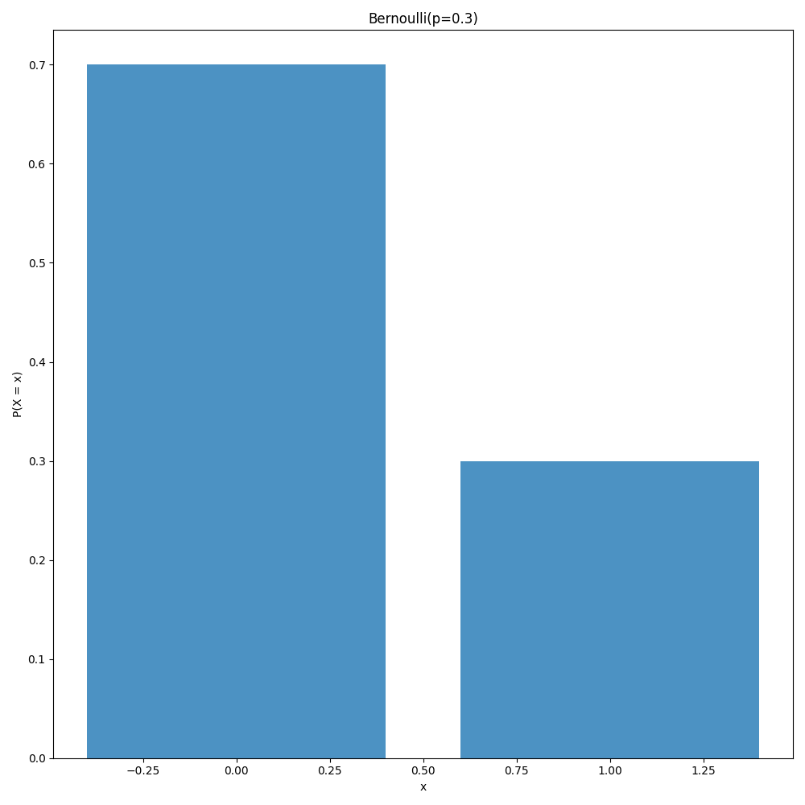
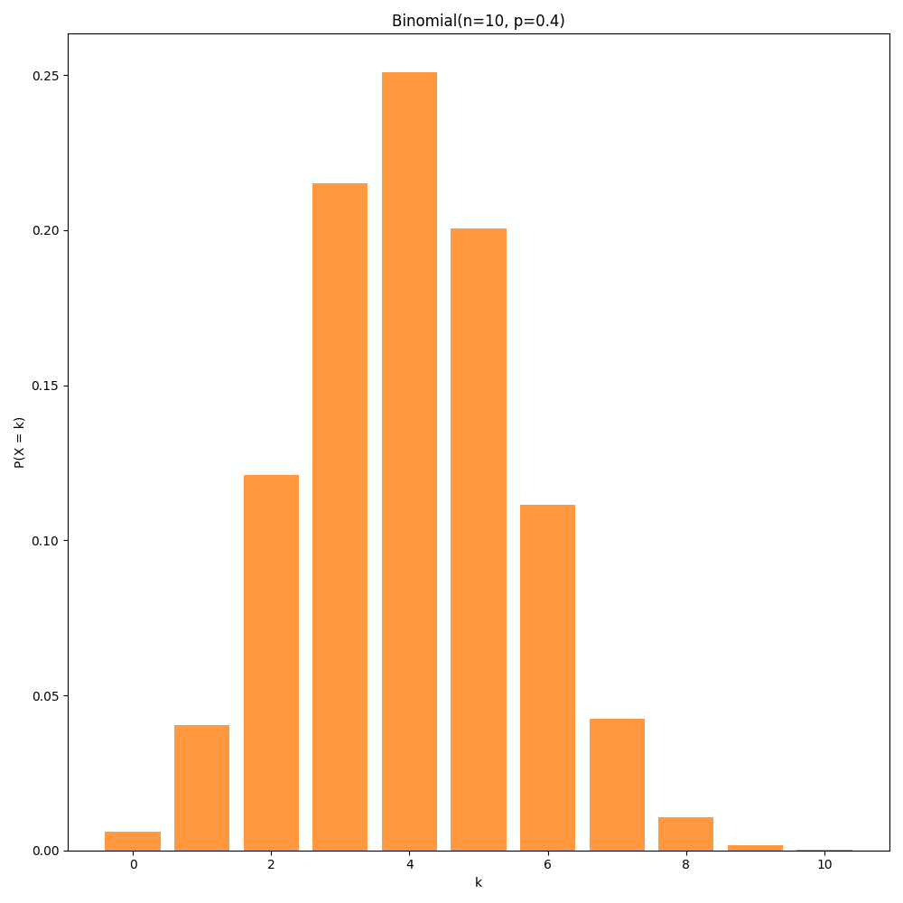
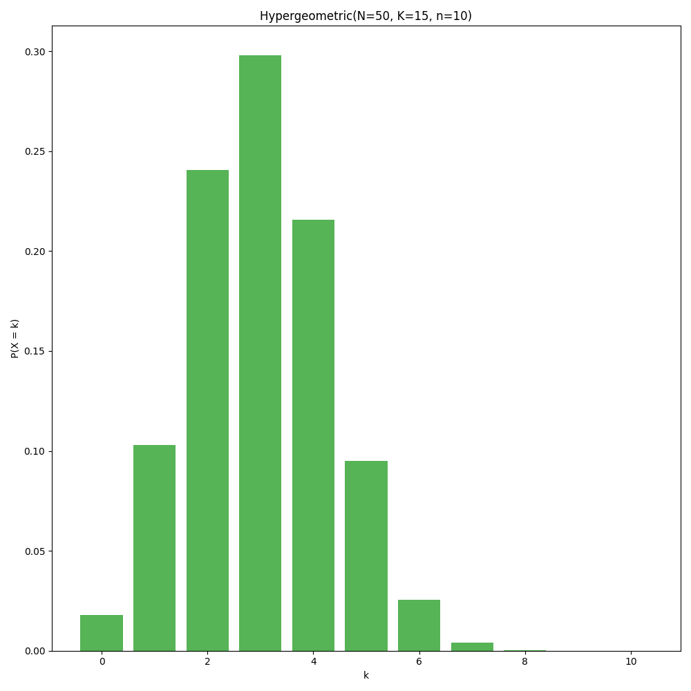
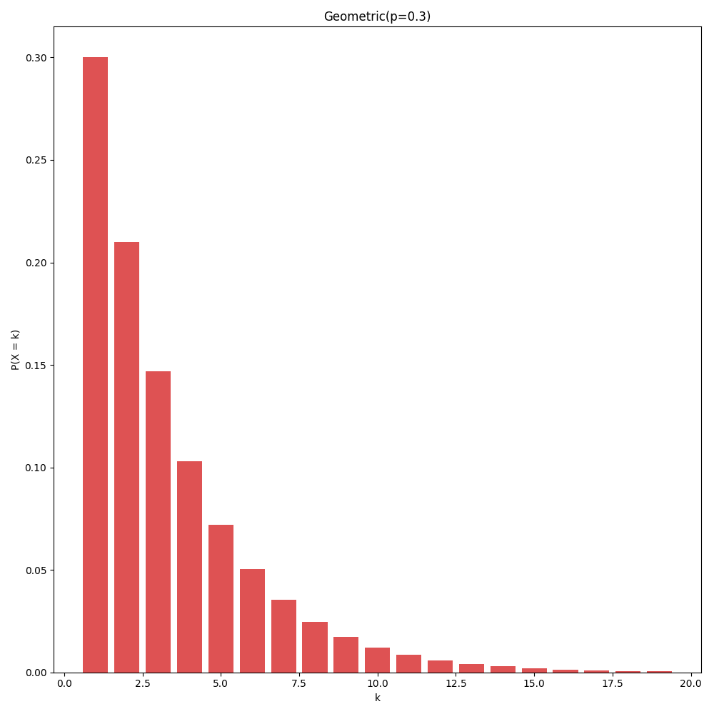
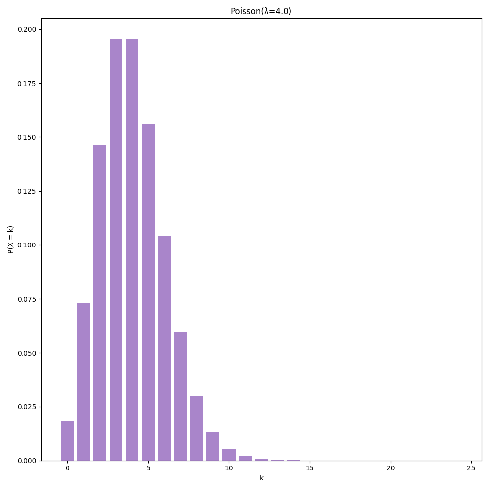
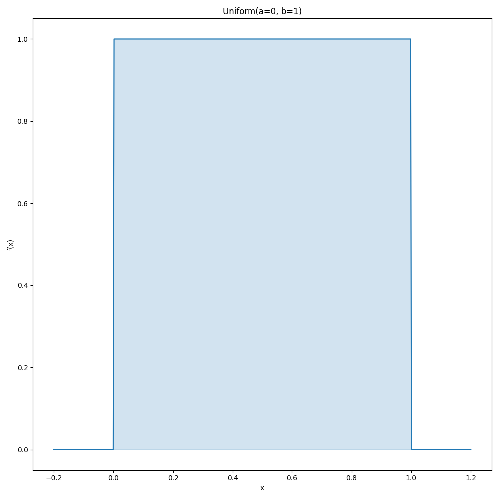
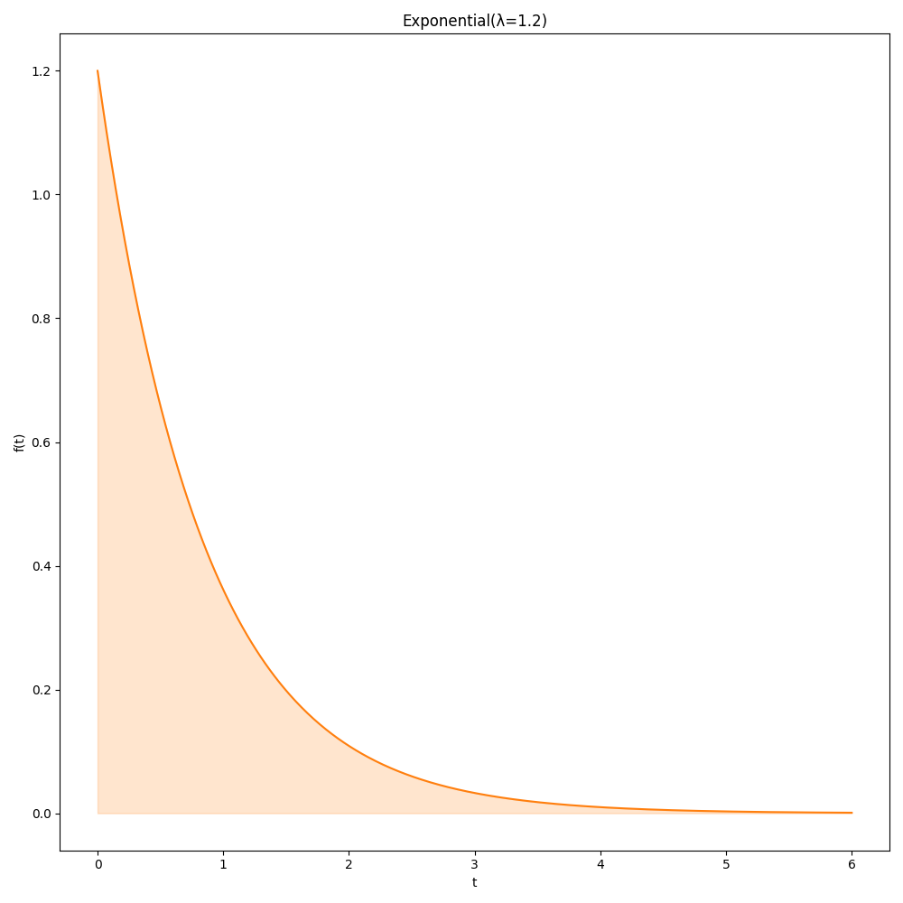
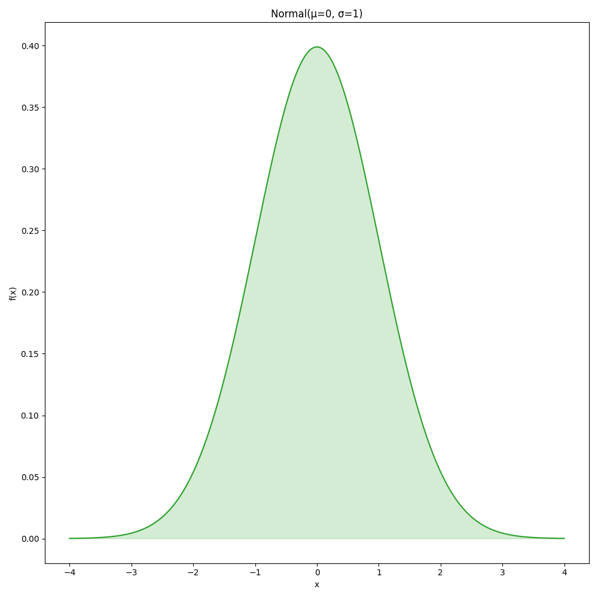

# Распределения

| Свойство / Dist          | **Bernoulli**                         | **Binomial**                                    |
| ------------------------ | ------------------------------------- | ----------------------------------------------- |
| **Граф**                 |                  |                            |
| **Тип**                  | дискретное                            | дискретное                                      |
| **Параметры**            | $p \in (0,1)$                         | $n \in \mathbb{N},; p \in (0,1)$                |
| **Поддержка (значения)** | $x \in {0,1}$                         | $k = 0,1,\dots,n$                               |
| **PMF / PDF**            | $P(X=1)=p\,;P(X=0)=1-p$               | $P(X=k)=\binom{n}{k}p^k(1-p)^{n-k}$             |
| **Мат. ожидание**        | $E[X]=p$                              | $E[X]=np$                                       |
| **Дисперсия**            | $Var[X]=p(1-p)$                       | $Var[X]=np(1-p)$                                |
| **Когда использовать**   | Один эксперимент: успех/неуспех $0/1$ | Количество успехов в $n$ независимых испытаниях |

| Свойство / Dist          | **Hypergeometric**                                          | **Geometric**                     |
| ------------------------ | ----------------------------------------------------------- | --------------------------------- |
| **Граф**                 |                                        |              |
| **Тип**                  | дискретное                                                  | дискретное                        |
| **Параметры**            | $N \in \mathbb{N},; K \in {0,\dots,N},; n \in {0,\dots,N}$  | $p \in (0,1)$                     |
| **Поддержка (значения)** | $k = 0,1,\dots,n$                                           | $k = 1,2,\dots$                   |
| **PMF / PDF**            | $P(X=k)=\dfrac{\binom{K}{k}\binom{N-K}{n-k}}{\binom{N}{n}}$ | $P(X=k)=(1-p)^{k-1}p$             |
| **Мат. ожидание**        | $E[X]=n\cdot \dfrac{K}{N}$                                  | $E[X]=\dfrac{1}{p}$               |
| **Дисперсия**            | $Var[X]=n \dfrac{K}{N}\dfrac{N-K}{N}\dfrac{N-n}{N-1}$       | $Var[X]=\dfrac{1-p}{p^2}$         |
| **Когда использовать**   | Выбор из конечной популяции **без возврата**                | Сколько попыток до первого успеха |

| Свойство / Dist          | **Poisson**                                         | **Uniform**                                |
| ------------------------ | --------------------------------------------------- | ------------------------------------------ |
| **Граф**                 |                                |                       |
| **Тип**                  | дискретное                                          | непрерывное                                |
| **Параметры**            | $\lambda > 0$                                       | $a < b$                                    |
| **Поддержка (значения)** | $k = 0,1,2,\dots$                                   | $x \in [a,b]$                              |
| **PMF / PDF**            | $P(X=k)=\dfrac{\lambda^k}{k!}e^{-\lambda}$          | $f(x)=\dfrac{1}{b-a}\,; a\le x\le b$       |
| **Мат. ожидание**        | $E[X]=\lambda$                                      | $E[X]=\dfrac{a+b}{2}$                      |
| **Дисперсия**            | $Var[X]=\lambda$                                    | $Var[X]=\dfrac{(b-a)^2}{12}$               |
| **Когда использовать**   | Количество редких событий за фиксированный интервал | Полное равенство шансов на отрезке $[a,b]$ |

| Свойство / Dist          | **Exponential**                               | **Normal**                                                                            |
| ------------------------ | --------------------------------------------- | ------------------------------------------------------------------------------------- |
| **Граф**                 |                          |                                                                  |
| **Тип**                  | непрерывное                                   | непрерывное                                                                           |
| **Параметры**            | $\lambda > 0$                                 | $\mu \in \mathbb{R}\,; \sigma^2 > 0$                                                  |
| **Поддержка (значения)** | $t \ge 0$                                     | $x \in \mathbb{R}$                                                                    |
| **PMF / PDF**            | $f(t)=\lambda e^{-\lambda t}\,; t\ge 0$       | $f(x)=\dfrac{1}{\sigma\sqrt{2\pi}}e^{-\dfrac{1}{2}\Big(\dfrac{x-\mu}{\sigma}\Big)^2}$ |
| **Мат. ожидание**        | $E[X]=\dfrac{1}{\lambda}$                     | $E[X]=\mu$                                                                            |
| **Дисперсия**            | $Var[X]=\dfrac{1}{\lambda^2}$                 | $Var[X]=\sigma^2$                                                                     |
| **Когда использовать**   | Время до следующего события в потоке Пуассона | Сумма большого числа мелких независимых влияний                                       |