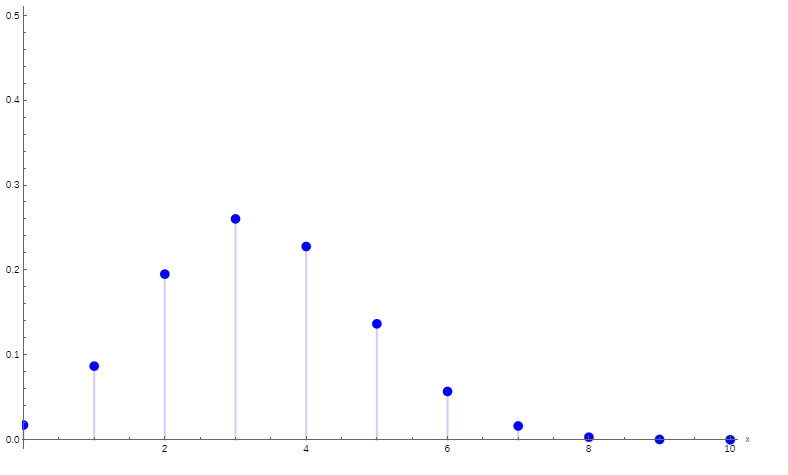
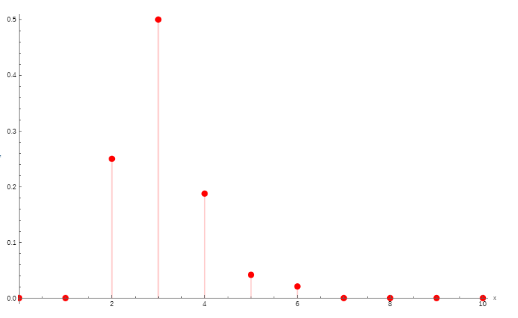
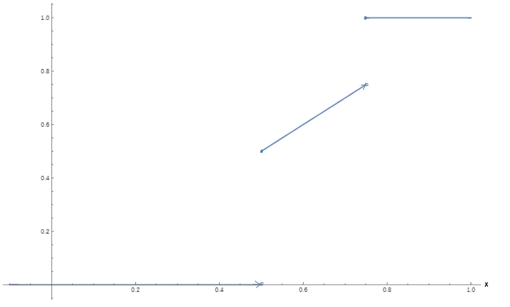

# CSE206 — Week 04 Notes — Expectation/variance (moments, covariance, Markov/Chebyshev)
**Lectures:** CSE206_Fa24-04.pdf
**Lab/Tutorial:** week04.pdf

## 1. Big picture (5–10 bullets)
- This week develops the concept of expected value (mean) for discrete random variables and shows how it relates to long-run averages.
- Variance and higher moments are introduced to measure how far values typically lie from the mean.
- Linearity of expectation and properties of variance allow efficient computation of means and variances, especially for sums of independent variables.
- Covariance and the covariance matrix describe how two or more random variables vary together; correlation is a normalized version.
- Conditional expectation is defined for discrete random variables and is itself a random variable.
- Markov’s and Chebyshev’s inequalities provide general, simple bounds on probabilities using only means and variances.
- The lecture extends the definition of expectation beyond discrete variables using cdfs, covering mixed and continuous cases.
- The lab reinforces these ideas with exercises on variance, covariance, conditional expectation, and expectations of common distributions (Poisson, geometric, hypergeometric, etc.).

## 2. Key concepts and definitions

### 2.1 Expected value of a discrete random variable
- Plain-language definition.
  - The expected value (mean) of a discrete random variable is the “long-run average” value you would see if you repeated the experiment many times.
- Formal definition (if needed).
  - Let $\xi$ be a discrete random variable with pmf $p_\xi(x)=P(\xi=x)$. Its expected value is
    $$
    E\xi = \sum_{x\in\mathbb{R}} x\,p_\xi(x),
    $$
    where the sum is over the (countable) set of values with $p_\xi(x)>0$, provided the series converges absolutely.
- Intuition / mental model.
  - Imagine running the experiment $N$ times (large), summing all observed values, and dividing by $N$; the result should be close to $E\xi$.
  - For a discrete variable taking values $y_1,\dots,y_n$ with probabilities $p_1,\dots,p_n$, the sample mean will be close to $p_1y_1+\dots+p_ny_n$.
- Tiny example.
  - If $\xi$ takes values $-1,0,2$ with probabilities $1/4,1/2,1/4$ respectively, then
    $$
    E\xi = (-1)\cdot\frac14 + 0\cdot\frac12 + 2\cdot\frac14 = -\frac14+0+\frac12=\frac14.
    $$

### 2.2 Expectation of indicator variables
- Plain-language definition.
  - The expected value of an indicator random variable is just the probability of the underlying event.
- Formal definition (if needed).
  - For an event $E$, its indicator is $I(E)(\omega)=1$ if $\omega\in E$ and $0$ otherwise.
  - If $P(E)=p$, then
    $$
    EI(E)=1\cdot p+0\cdot(1-p)=p.
    $$
- Intuition / mental model.
  - If you record 1 every time an event happens and 0 otherwise, the average of these 0–1 values is the event’s probability.
- Tiny example.
  - Let $E$ = “a fair die shows a 6”. Then $P(E)=1/6$, and if $\xi=I(E)$, then $E\xi=1/6$.

### 2.3 Linearity and basic properties of expectation
- Linearity.
  - For random variables $\xi_1,\dots,\xi_n$ with finite means,
    $$
    E(\xi_1+\dots+\xi_n) = E\xi_1+\dots+E\xi_n.
    $$
  - For a constant $c$ and random variable $\xi$ with finite mean,
    $$
    E(c\xi)=c\,E\xi.
    $$
- Preservation of order.
  - If $P(\xi\le\eta)=1$ (i.e., $\xi(\omega)\le\eta(\omega)$ for all outcomes), and both expectations exist, then $E\xi\le E\eta$.
- Independence and product of expectations.
  - If $\xi_1$ and $\xi_2$ are independent, then
    $$
    E(\xi_1\xi_2) = E\xi_1\,E\xi_2.
    $$
  - For independent discrete $\xi_1,\dots,\xi_n$,
    $$
    E(\xi_1\cdots\xi_n) = E\xi_1\cdots E\xi_n.
    $$
- Intuition / mental model.
  - Linearity lets you “pull the expectation through” sums and constants; it is extremely powerful for computing means of complicated random variables.
  - Independence lets you factor expectations of products into products of expectations.
- Tiny example (binomial mean, revisited).
  - If $\xi_1,\dots,\xi_n$ are independent Bernoulli$(p)$ and $\xi=\xi_1+\dots+\xi_n$, then
    $$
    E\xi = E(\xi_1+\dots+\xi_n)=E\xi_1+\dots+E\xi_n= p+\dots+p = np.
    $$

### 2.4 Moments and variance
- Plain-language definitions.
  - The first moment of a random variable $\xi$ is its mean $E\xi$.
  - The second moment is $E\xi^2$.
  - The variance measures how much $\xi$ typically deviates from its mean, with big deviations penalized more.
- Formal definitions (if needed).
  - $n$-th moment: $E\xi^n$ (if it exists) for integer $n\ge1$.
  - Variance:
    $$
    \text{Var}(\xi) = E(\xi-E\xi)^2,
    $$
    whenever this expectation is finite.
  - Equivalent formula (very useful):
    $$
    \text{Var}(\xi) = E\xi^2 - (E\xi)^2.
    $$
- Properties (from lecture).
  - $\text{Var}(\xi)\ge0$.
  - If $\text{Var}(\xi)=0$, then $\xi$ is almost surely constant: $P(\xi=c)=1$ for some $c$.
  - For constant $c$: $\text{Var}(c\xi)=c^2\text{Var}(\xi)$.
  - If $\xi_1,\dots,\xi_n$ are independent with finite variances, then
    $$
    \text{Var}(\xi_1+\dots+\xi_n) = \text{Var}(\xi_1)+\dots+\text{Var}(\xi_n).
    $$
- Intuition / mental model.
  - Variance is a weighted average of squared distances from the mean; squaring makes large deviations much more influential.
  - For sums of independent variables, variances add (but means always add even without independence).
- Tiny example.
  - For $\xi\sim\text{Bernoulli}(p)$, lecture shows
    $$
    \text{Var}(\xi)=p(1-p).
    $$
    This matches the idea that variability is largest when $p=1/2$ and goes to 0 as $p\to0$ or $p\to1$.

### 2.5 Computing expectations of functions of a discrete random variable
- Statement (Theorem 2.2).
  - Let $\xi$ be a discrete random variable with pmf $p_\xi$, and let $g:\mathbb{R}\to\mathbb{R}$ be measurable. If the sum converges, then
    $$
    Eg(\xi) = \sum_x g(x)p_\xi(x).
    $$
- Intuition / mental model.
  - You do not need to find the pmf of $g(\xi)$ separately. You can compute its expectation directly by summing $g(x)$ times the probability that $\xi=x$.
- Tiny example (used in lecture).
  - For $\xi\sim\text{Geo}(p)$, taking $g(x)=x^2$ and using known series (plus differentiation tricks) yields $E\xi^2$, and then $\text{Var}(\xi)=E\xi^2-(E\xi)^2$.

### 2.6 Covariance, covariance matrix, and correlation
- Plain-language definitions.
  - Covariance measures how two random variables vary together relative to their means.
  - A covariance matrix collects all variances and covariances of components of a random vector.
  - Correlation is a normalized covariance, always between $-1$ and $1$, that measures linear dependence strength.
- Formal definitions (if needed).
  - For a two-dimensional random vector $\xi=(\xi_1,\xi_2)$ with finite means:
    $$
    \text{Cov}(\xi_1,\xi_2) = E(\xi_1-E\xi_1)(\xi_2-E\xi_2).
    $$
  - Equivalent formula:
    $$
    \text{Cov}(\xi_1,\xi_2) = E(\xi_1\xi_2) - E\xi_1\,E\xi_2.
    $$
  - Covariance matrix of a vector $(\xi_1,\dots,\xi_d)$ is the $d\times d$ matrix with entries $\text{Cov}(\xi_i,\xi_j)$; its diagonal entries are variances.
  - Correlation coefficient of $(\xi_1,\xi_2)$:
    $$
    \rho = \frac{\text{Cov}(\xi_1,\xi_2)}{\sqrt{\text{Var}(\xi_1)\,\text{Var}(\xi_2)}}.
    $$
- Properties (from lecture).
  - If $\xi_1$ and $\xi_2$ are independent and have finite variances, then $\text{Cov}(\xi_1,\xi_2)=0$.
  - But the converse is not true: covariance zero (uncorrelated) does not imply independence.
  - Bunyakovsky’s inequality gives
    $$
    |\text{Cov}(\xi_1,\xi_2)| \le \sqrt{\text{Var}(\xi_1)\,\text{Var}(\xi_2)}.
    $$
- Intuition / mental model.
  - Positive covariance means when one variable is above its mean, the other tends to be above its mean too; negative covariance means opposite behavior.
  - Correlation rescales covariance to be dimensionless and between $-1$ and $1$.

### 2.7 Conditional expectation (discrete case)
- Plain-language definition.
  - Conditional expectation $E[\xi_1|\xi_2]$ is a new random variable that gives the expected value of $\xi_1$ when we know the value of $\xi_2$.
- Formal definition (if needed).
  - Let $\xi=(\xi_1,\xi_2)$ be a discrete random vector. For a fixed value $y$ where $P(\xi_2=y)>0$, the conditional pmf is
    $$
    p_{\xi_1|\xi_2}(x|y) = P(\xi_1=x|\xi_2=y),
    $$
    and the conditional expectation given $\xi_2=y$ is
    $$
    E[\xi_1|\xi_2 = y] = \sum_x x\,p_{\xi_1|\xi_2}(x|y).
    $$
  - The conditional expectation $E[\xi_1|\xi_2]$ is the random variable $\eta$ defined by
    $$
    \eta(\omega) = E[\xi_1|\xi_2 = \xi_2(\omega)].
    $$
- Intuition / mental model.
  - For each possible value $y$ of $\xi_2$, you compute the mean of $\xi_1$ under that condition; then as $\xi_2$ varies, this gives a new random variable.

### 2.8 Markov’s and Chebyshev’s inequalities
- Markov’s inequality (nonnegative $\xi$).
  - If $\xi\ge0$ and $E\xi$ exists, then for any $x>0$:
    $$
    P(\xi\ge x) \le \frac{E\xi}{x}.
    $$
  - Derived using the decomposition $E\xi=E(\xi I(\xi<x)) + E(\xi I(\xi\ge x))$ and the fact that $\xi\ge x$ on $\{\xi\ge x\}$.
- Chebyshev’s inequality.
  - If $\xi$ has finite mean and variance, then for any $x>0$:
    $$
    P(|\xi-E\xi|\ge x) \le \frac{\text{Var}(\xi)}{x^2}.
    $$
  - Derived by applying Markov’s inequality to the nonnegative variable $|\xi-E\xi|^2$.
- Intuition / mental model.
  - Markov: a nonnegative random variable cannot be very large very often if its mean is small.
  - Chebyshev: a random variable with small variance is unlikely to deviate far from its mean.
  - The lecture shows an application to sums of independent Bernoulli variables (binomial) to obtain bounds that resemble a weak law of large numbers.

## 3. Core formulas and how to use them

### 3.1 Expectation and variance of discrete random variables
- Expectation.
  - For discrete $\xi$ with pmf $p_\xi(x)$:
    $$
    E\xi = \sum_x x\,p_\xi(x).
    $$
- Variance.
  - Definition: $\text{Var}(\xi)=E(\xi-E\xi)^2$.
  - Computation-friendly form:
    $$
    \text{Var}(\xi) = E\xi^2 - (E\xi)^2.
    $$
- When to use them.
  - To compute means and variances directly from pmfs, especially for small finite support.
  - To analyze variability in lab problems (Poisson, geometric, hypergeometric, binomial, etc.).
- Common mistakes.
  - Forgetting to square $(\xi-E\xi)$ when computing variance.
  - Using $\text{Var}(\xi)=E\xi^2$ instead of $\text{Var}(\xi)=E\xi^2 - (E\xi)^2$.

### 3.2 Linearity and variance rules
- Linearity of expectation.
  - For any random variables $\xi_1,\dots,\xi_n$ with finite expectations:
    $$
    E\left(\sum_{j=1}^n \xi_j\right) = \sum_{j=1}^n E\xi_j.
    $$
  - No independence is required.
- Variance rules.
  - For constant $c$: $\text{Var}(c\xi)=c^2\text{Var}(\xi)$.
  - For independent $\xi_1,\dots,\xi_n$:
    $$
    \text{Var}\left(\sum_{j=1}^n \xi_j\right) = \sum_{j=1}^n \text{Var}(\xi_j).
    $$
- When to use them.
  - To compute mean and variance of sums, such as total number of successes, total number of sixes on dice, totals in urn problems, etc.
- Common mistakes.
  - Assuming “variance is linear” without independence; for non-independent variables, cross terms appear.
  - Forgetting to square $c$ when pulling it out of variance.

### 3.3 Covariance and correlation
- Covariance formula.
  - $$
    \text{Cov}(\xi_1,\xi_2) = E\xi_1\xi_2 - E\xi_1\,E\xi_2.
    $$
- Correlation formula.
  - $$
    \rho(\xi_1,\xi_2) = \frac{\text{Cov}(\xi_1,\xi_2)}{\sqrt{\text{Var}(\xi_1)\,\text{Var}(\xi_2)}}.
    $$
- When to use them.
  - To quantify dependence between parts of a random vector (e.g., joint distributions in the lab table problem).
  - To check if variables are uncorrelated and to compute covariance matrices.
- Common mistakes.
  - Thinking $\text{Cov}(\xi_1,\xi_2)=0$ implies independence; it only implies “no linear correlation”.

### 3.4 Markov and Chebyshev inequalities
- Markov (nonnegative $\xi$).
  - $$
    P(\xi\ge x) \le \frac{E\xi}{x},\quad x>0.
    $$
- Chebyshev (finite mean, variance).
  - $$
    P(|\xi-E\xi|\ge x) \le \frac{\text{Var}(\xi)}{x^2},\quad x>0.
    $$
- When to use them.
  - When exact probabilities are hard to compute but rough bounds suffice.
  - To show that sums of many independent terms concentrate near their mean (as in the binomial example in the lecture).
- Common mistakes.
  - Applying Markov to variables that can take negative values without first shifting or otherwise adapting.
  - Treating these bounds as tight approximations; they are often conservative.

## 4. Worked examples

### 4.1 St. Petersburg paradox (expectation does not exist)
- Setup (from lecture).
  - Game: toss a fair coin until the first head appears. If the first head appears on toss $n$, you receive $2^n$ rubles.
  - Let $N$ be the number of tosses and $\xi = 2^N$ be your payoff.
- Step 1: find the distribution of $N$ and $\xi$.
  - The game ends at toss $n$ if you see $n-1$ tails followed by a head. For a fair coin,
    $$
    P(N=n) = \left(\frac12\right)^{n-1}\frac12 = \left(\frac12\right)^n.
    $$
  - Since $\xi=2^N$, the event $\{\xi=2^n\}$ is the same as $\{N=n\}$, so
    $$
    P(\xi=2^n)=\left(\frac12\right)^n,\quad n=1,2,\dots
    $$
- Step 2: compute the expected payoff.
  -
    $$
    E\xi = \sum_{n=1}^\infty 2^n P(\xi=2^n)
         = \sum_{n=1}^\infty 2^n \left(\frac12\right)^n
         = \sum_{n=1}^\infty 1
         = +\infty.
    $$
  - The series diverges; the expectation is infinite.
- Step 3: interpretation.
  - The formal expected payoff is larger than any finite amount of money: the mean does not exist as a finite real number.
  - This is the St. Petersburg paradox: a game with seemingly modest stakes but infinite expected value.
- Check your intuition.
  - Very large payoffs (like $2^{20}$, $2^{30}$, etc.) are extremely rare, but their size grows so quickly that their contributions to the expected value never die out.

### 4.2 Mean and variance of a Bernoulli and binomial random variable
- Bernoulli mean and variance (from lecture Example 1.1 and 2.1).
  - Let $\xi\sim\text{Bernoulli}(p)$. The pmf is $P(\xi=1)=p$, $P(\xi=0)=1-p$.
  - Mean:
    $$
    E\xi = 1\cdot p + 0\cdot(1-p) = p.
    $$
  - Variance (directly from definition):
    - $\xi-E\xi$ takes value $1-p$ when $\xi=1$ (probability $p$), and $-p$ when $\xi=0$ (probability $1-p$).
    -
      $$
      \text{Var}(\xi) = (1-p)^2 p + (-p)^2(1-p)
                      = p - 2p^2 + p^3 + p^2 - p^3
                      = p(1-p).
      $$
- Binomial mean via two methods (from lecture Example 1.2).
  - Let $\xi\sim\text{Binomial}(n,p)$.
  - Method 1 (direct summation):
    $$
    E\xi = \sum_{x=0}^n x\binom{n}{x}p^x(1-p)^{n-x},
    $$
    then manipulate the sum using the identity $x\binom{n}{x}=n\binom{n-1}{x-1}$ to obtain
    $$
    E\xi = np.
    $$
  - Method 2 (using Bernoulli sum and linearity).
    - Let $\xi_1,\dots,\xi_n$ be independent Bernoulli$(p)$ and $\eta = \xi_1+\dots+\xi_n$.
    - By counting, $\eta$ has the same distribution as a binomial $\text{Binomial}(n,p)$, so $\eta$ and $\xi$ are identically distributed.
    - Using linearity and the known Bernoulli mean:
      $$
      E\xi = E\eta = E(\xi_1+\dots+\xi_n) = E\xi_1+\dots+E\xi_n = np.
      $$
- Check your intuition.
  - For $n$ trials with success probability $p$, the average number of successes is $np$; the result aligns with everyday expectations.
  - For a single trial (Bernoulli), variance $p(1-p)$ is largest near $p=0.5$ and vanishes as outcomes become almost certain.

## 5. Lab/Tutorial essentials (week04.pdf)

### 5.1 What the lab asked you to do
- Problem 1: Poisson mean and variance.
  - Given $\xi\sim\text{Poi}(\lambda)$, find $E[\xi(\xi-1)]$ and then deduce $\text{Var}(\xi)$.
- Problem 2: Shift invariance of variance.
  - Prove $\text{Var}(\xi) = \text{Var}(\xi+c)$ for any constant $c$, assuming $\text{Var}(\xi)$ exists.
- Problem 3: Mean and variance from a cdf.
  - For a random variable $\xi$ with cdf
    $$
    F(x) = xI\left(\frac13\le x<\frac12\right) + I\left(x\ge\frac12\right),
    $$
    compute $E\xi$ and $\text{Var}(\xi)$.
- Problem 4: Covariance of a symmetric discrete vector.
  - Random vector $(\xi_1,\xi_2)$ satisfies $P(\xi_1\xi_2 = 0)=1$ and $P(\xi_j=1)=P(\xi_j=-1)=1/4$ for $j=1,2$.
  - Find $E\xi_1,E\xi_2,\text{Var}(\xi_1),\text{Var}(\xi_2),\text{Cov}(\xi_1,\xi_2)$.
- Problem 5: Conditional expectation in a defect-testing model.
  - There are $N$ manufactured items (“dipopers”) with defect probability $p$. Each is independently tested, and the test detects an existing defect with probability $r$.
  - Let $\xi$ be the number of defective items, and $\eta$ the number detected as defective by the test.
  - Show
    $$
    E[\xi|\eta] = \frac{N p(1-r)+(1-p)\eta}{1-pr}.
    $$
- Problem 6: Mean and variance of Geometric$(p)$.
  - Find $E\xi$ and $\text{Var}(\xi)$ for $\xi\sim\text{Geo}(p)$.
- Problem 7: Fixed points of a random permutation.
  - Let $\xi$ be the number of fixed points when permuting $\{1,\dots,n\}$ uniformly at random.
  - Find $E\xi$ and $\text{Var}(\xi)$.
- Homework tasks (selected).
  - Build pmfs from given mean/variance constraints.
  - Compute expectations in card, lift, urn, and dice problems using linearity and indicator variables.
  - Analyze joint distributions, independence, and correlation for a tabulated discrete distribution.

### 5.2 How to solve / approach them
- Using known distribution formulas.
  - For Poisson and geometric random variables, use known pmfs and the theorem $Eg(\xi)=\sum g(x)p_\xi(x)$.
  - For Poisson:
    - Use the identity $E[\xi(\xi-1)] = \lambda^2$ and links between $E\xi$, $E\xi(\xi-1)$, and $E\xi^2$ to derive $\text{Var}(\xi)=\lambda$.
  - For geometric:
    - Compute $E\xi$ and $E\xi^2$ via series (or known formulas) and subtract $(E\xi)^2$ to get variance.
- Working from a cdf.
  - For Problem 3, identify intervals where the cdf is constant or linear to extract the distribution:
    - On $(-\infty,1/3)$, $F(x)=0$.
    - On $[1/3,1/2)$, $F(x)=x$, implying a density of 1 there.
    - At $x=1/2$, the cdf jumps to 1, corresponding to a point mass.
  - Combine continuous and discrete parts to compute $E\xi$ and $E\xi^2$, then variance.
- Covariance and independence from joint conditions.
  - In problems like (4) and (16), use the given conditions to reconstruct the joint pmf.
  - Compute marginals by summing rows/columns, then means and variances from the marginals.
  - Use $\text{Cov}(\xi_1,\xi_2)=E\xi_1\xi_2-E\xi_1E\xi_2$.
  - Check independence by comparing $P(\xi=x,\eta=y)$ vs $P(\xi=x)P(\eta=y)$.
- Conditional expectation in the dipoper problem.
  - Express $\xi$ as a sum of independent Bernoulli indicators for “item defective”.
  - Express $\eta$ as a sum of indicators for “defect detected”.
  - Use linearity of expectation and conditional expectation plus independence to compute $E[\xi|\eta]$ in terms of $\eta$.
- Using indicators and linearity for combinatorial expectations.
  - For fixed points of a random permutation, define indicator $I_j$ that element $j$ is fixed. Then
    $$
    \xi = \sum_{j=1}^n I_j,
    $$
    and compute $E\xi$ as $\sum E I_j$. Similar ideas help with lift stops, number of white balls, etc.

### 5.3 Mini practice
- Practice 1: variance and shifts.
  - Question: Let $\xi$ be any random variable with finite variance and $c$ a constant. Why is $\text{Var}(\xi+c)=\text{Var}(\xi)$?
  - Brief answer: $\xi+c$ has mean $E\xi+c$; the deviations from the mean are $(\xi+c)-(E\xi+c)=\xi-E\xi$, so the squared deviations (and hence variance) are unchanged.
- Practice 2: expectation via indicators (fixed points).
  - Question: For a random permutation of $\{1,\dots,n\}$, let $\xi$ be the number of fixed points. What is $E\xi$?
  - Brief answer: Define $I_j$ = indicator that element $j$ is fixed. Then $E I_j = P(\text{element }j\text{ is fixed}) = 1/n$, so
    $$
    E\xi = \sum_{j=1}^n E I_j = n\cdot \frac1n = 1.
    $$
- Practice 3: Markov inequality.
  - Question: If $\xi\ge0$ and $E\xi=5$, what is the Markov upper bound on $P(\xi\ge 20)$?
  - Brief answer: $P(\xi\ge 20)\le E\xi/20 = 5/20 = 0.25$.

## 6. Quick recap
- Expected value $E\xi = \sum x p_\xi(x)$ describes the long-run average of a discrete random variable and depends only on its pmf.
- Linearity of expectation and independence-based product rules make it easy to compute means of sums and products.
- Variance $\text{Var}(\xi)=E(\xi-E\xi)^2=E\xi^2-(E\xi)^2$ measures spread around the mean; for independent variables, variances add.
- Covariance and correlation quantify joint variability; zero covariance (uncorrelated) does not imply independence.
- Conditional expectation $E[\xi_1|\xi_2]$ is a random variable formed by averaging $\xi_1$ under each possible value of $\xi_2$.
- Markov’s and Chebyshev’s inequalities bound tail probabilities using only means and variances, and support results about concentration of sums around their mean.
- Expectation extends beyond purely discrete variables using cdfs and integrals; mixed distributions can combine discrete masses and continuous densities.
- The week 4 lab applies these concepts to Poisson, geometric, permutations, joint distributions, and real-world style models (testing, lifts, dice, cards).

[<kbd> <- Return (ProbStat) </kbd>](ProbStat.md)
