# CSE206 — Week 11 Notes — WLLN, Bernstein vs Chebyshev, CLT applications
**Lectures:** CSE206_Fa24-11.pdf
**Lab/Tutorial:** week11.pdf

## 1. Big picture (5–10 bullets)
- This week introduces two central limit theorems in probability: the weak law of large numbers (WLLN) and the central limit theorem (CLT).
- WLLN formalizes the “law of averages”: sample means of i.i.d. variables concentrate around the true mean as sample size grows.
- Bernstein’s inequality provides sharper concentration bounds than Chebyshev’s inequality for sums of Bernoulli random variables.
- CLT describes the approximate normal distribution of centered and scaled sums (or sample means) of i.i.d. variables with finite variance.
- Numerical experiments with exponential samples illustrate how histograms of sample means approach a normal shape.
- WLLN and CLT underpin statistical estimation: sample averages from polls or experiments become accurate and approximately normal for large samples.
- The lab applies Chebyshev’s inequality and CLT to dice, Bernoulli sequences, and other discrete models to bound or approximate probabilities.

<table><tr><td>
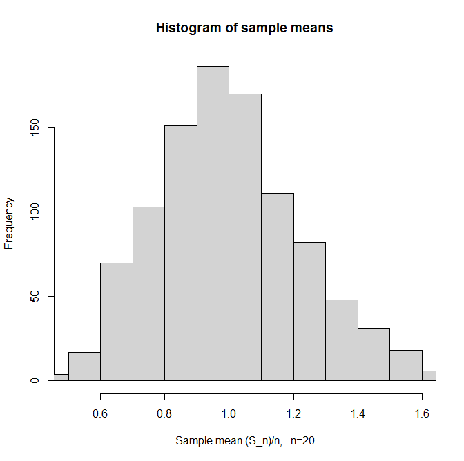
</td><td>
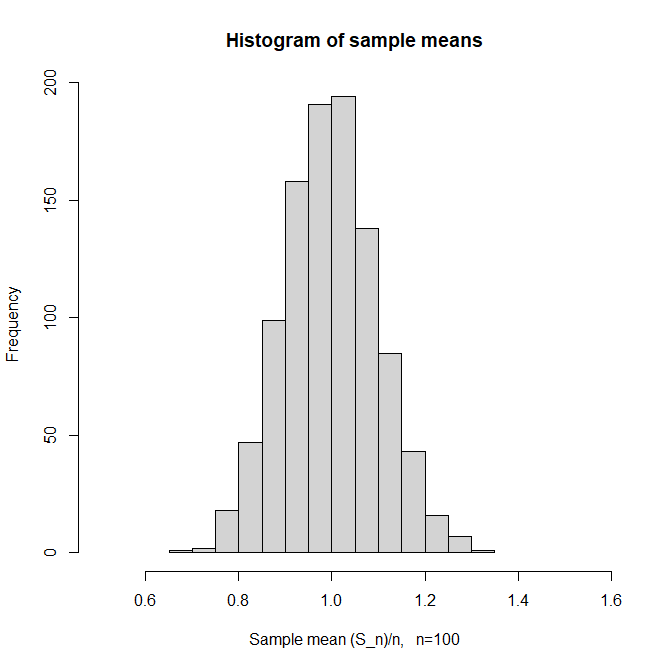
</td></tr><tr><td>
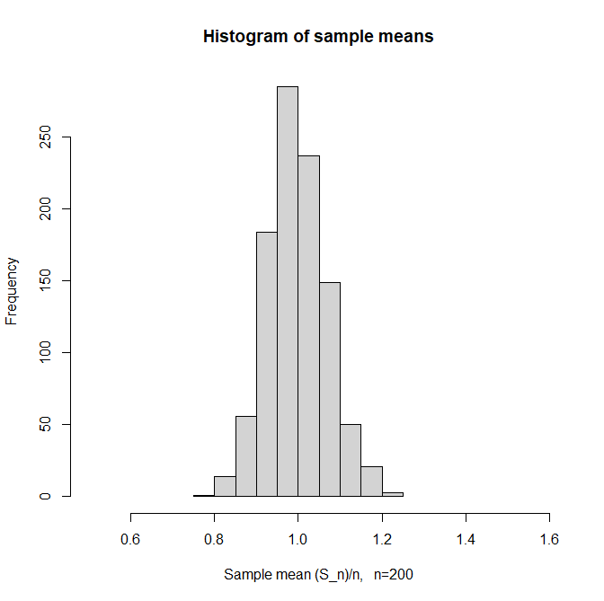
</td><td>
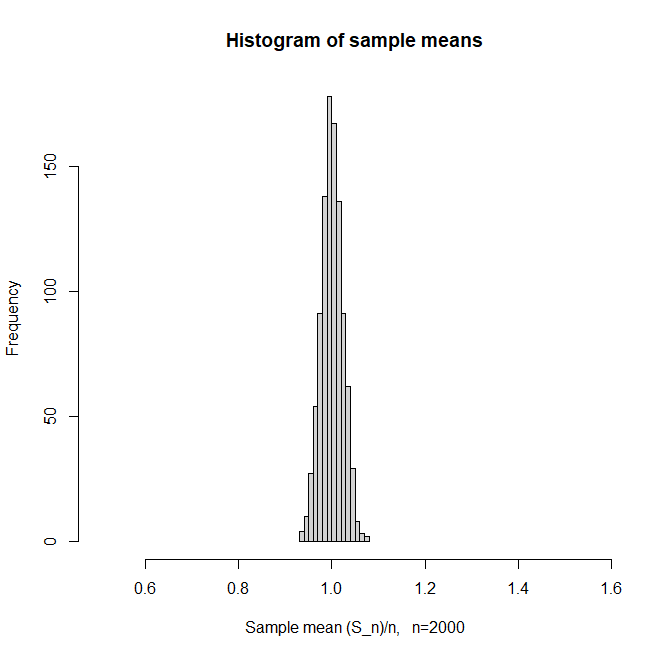
</td></tr><tr><td>
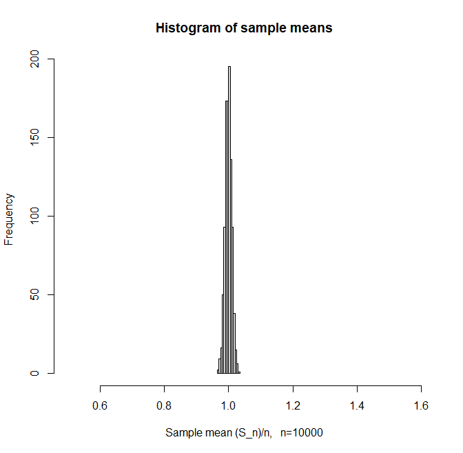
</td><td>
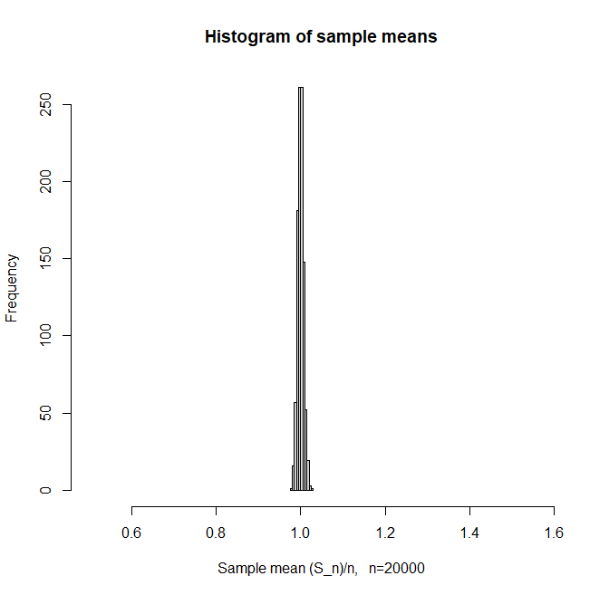
</td></tr><tr><td>
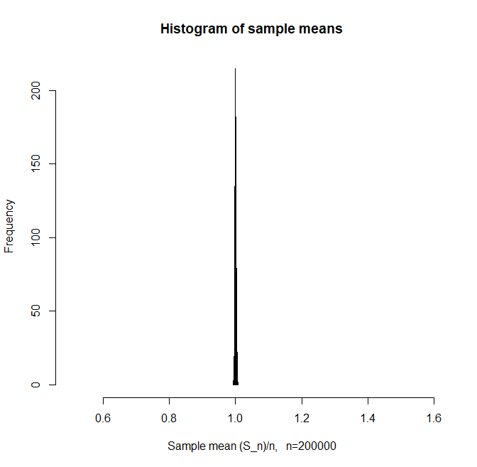
</td><td>

</td></tr><tr><td>
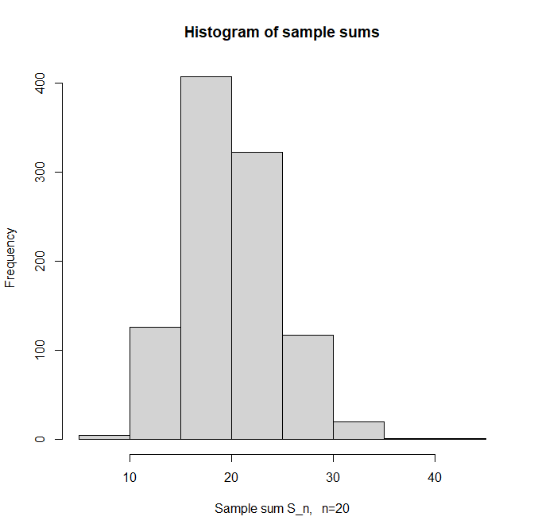
</td><td>
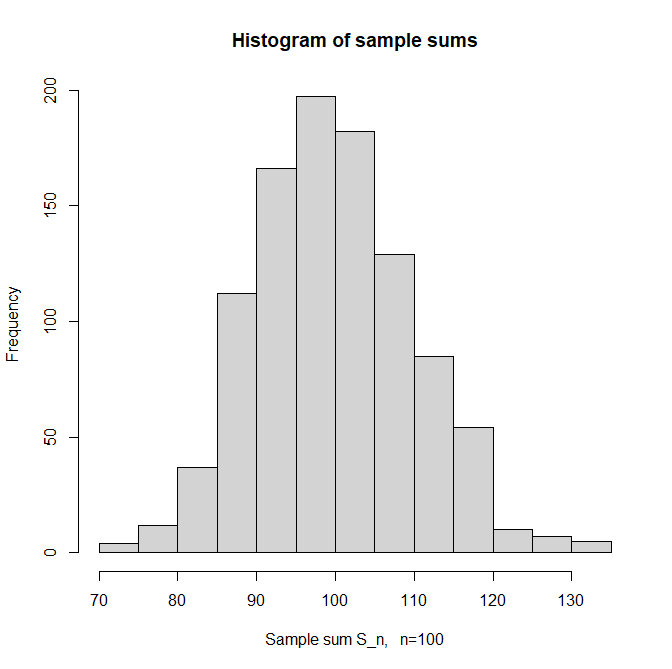
</td></tr><tr><td>
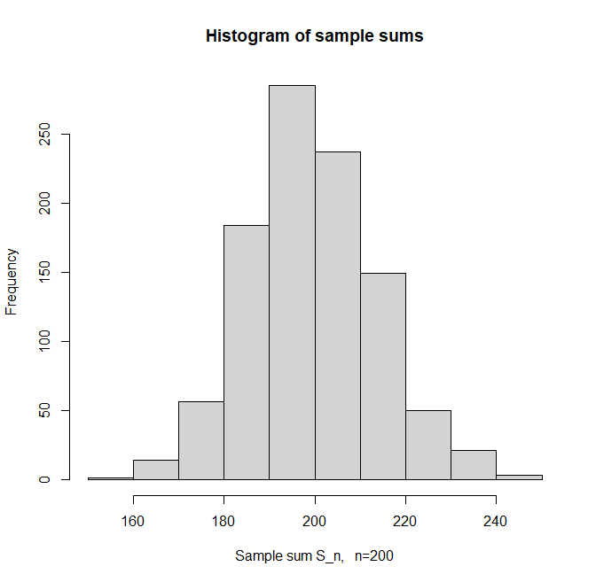
</td><td>
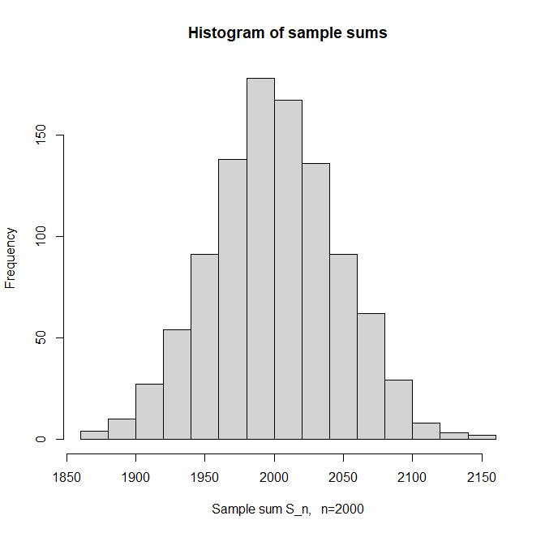
</td></tr><tr><td>
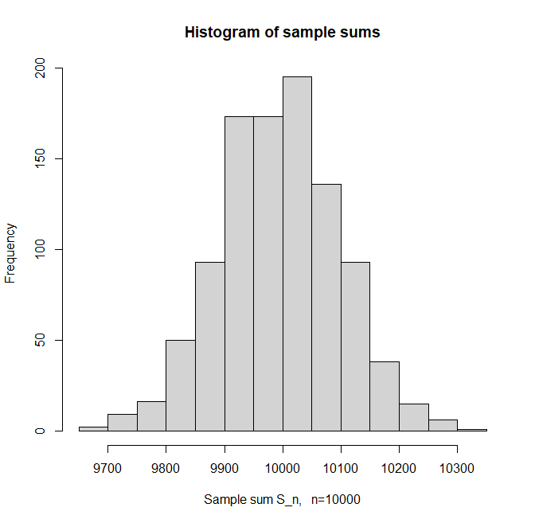
</td><td>
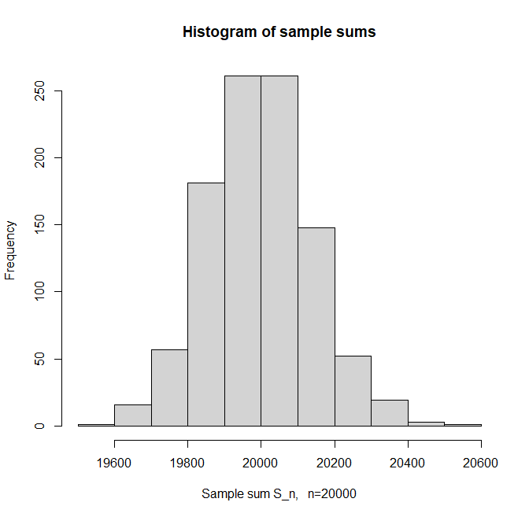
</td></tr><tr><td>
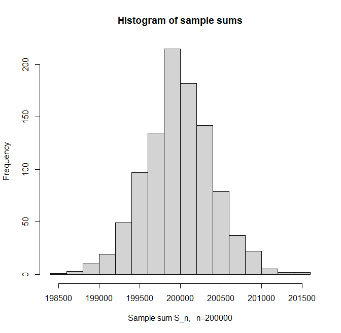
</td><td>

</td></tr></table>

## 2. Key concepts and definitions

### 2.1 Weak law of large numbers (WLLN)
- Plain-language statement.
  - For a sequence of independent copies (a sample) of a random variable with finite mean, the sample average converges in probability to the mean.
- Informal definition used in lecture.
  - A sequence of random variables $\xi_1,\xi_2,\dots$ (on the same probability space) satisfies the weak law of large numbers if there exists a number $a$ such that for every $\varepsilon>0$:
    $$
    \lim_{n\to\infty} P\left(\left|\frac{\xi_1+\dots+\xi_n}{n}-a\right|\ge\varepsilon\right)=0.
    $$
- Bernoulli sample case (Lecture 4 recap and section 1).
  - Let $\xi_1,\dots,\xi_n$ be independent Bernoulli$(p)$ variables and $S_n=\xi_1+\dots+\xi_n$.
  - Using Chebyshev’s inequality one gets (from earlier lectures)
    $$
    P\left(\left|\frac{S_n}{n}-p\right|\ge\varepsilon\right)\le \frac{p(1-p)}{n\varepsilon^2}\to 0 \quad (n\to\infty).
    $$
  - Thus independent identically distributed Bernoulli variables satisfy the WLLN with $a=p$.
- General statement (sketched).
  - The lecture notes that Chebyshev’s inequality can be extended to more general sequences (e.g., uncorrelated variables with uniformly bounded second moments), giving versions of the WLLN beyond Bernoulli samples.
- Intuition / mental model.
  - The sample average stabilizes around the true mean as sample size increases; deviations larger than any fixed $\varepsilon$ become unlikely.

### 2.2 Bernstein’s inequality (sharper WLLN bounds for Bernoulli)
- Plain-language statement.
  - For sums of independent Bernoulli variables, Bernstein’s inequality gives exponentially decaying bounds on the probability that the sample average deviates from the mean by more than $\varepsilon$.
- Formal statement (Theorem 1.2).
  - Let $\xi_1,\xi_2,\dots$ be independent Bernoulli$(p)$ variables, and $S_n = \xi_1+\dots+\xi_n$. Then for every $\varepsilon>0$:
    $$
    P\left(\frac{S_n}{n}\ge p+\varepsilon\right)\le e^{-n\varepsilon^2/4},\quad
    P\left(\frac{S_n}{n}\le p-\varepsilon\right)\le e^{-n\varepsilon^2/4}.
    $$
  - In particular,
    $$
    P\left(\left|\frac{S_n}{n}-p\right|\ge\varepsilon\right)\le 2e^{-n\varepsilon^2/4}.
    $$
- Proof sketch idea.
  - Start from
    $$
    P\left(\frac{S_n}{n}\ge p+\varepsilon\right) = P(S_n\ge\ell),
    $$
    where $\ell=\lceil n(p+\varepsilon)\rceil$, and use
    $$
    e^{\theta(j-n(p+\varepsilon))}\ge 1 \quad\text{for } j\ge \ell,
    $$
    to bound the tail using moment generating functions and an optimally chosen $\theta$.
  - A technical inequality $e^x\le x+e^{x^2}$ is used to simplify exponent terms and derive the final bound.
- Intuition / mental model.
  - Bernstein’s inequality yields much sharper (exponential) bounds than Chebyshev’s $O(1/n)$ bound in the Bernoulli case, especially for large $n$.

### 2.3 Samples, sample sums, and sample averages
- Sample of a random variable (Definition 1.4).
  - A sample of a random variable $\xi$ is a sequence of independent random variables $\xi_1,\dots,\xi_n$, each having the same distribution as $\xi$. The integer $n$ is the sample size.
  - A sample of a distribution (e.g. normal, binomial) means a sample of any random variable with that distribution.
- Sample average (sample mean).
  - For a sample $\xi_1,\dots,\xi_n$, the sample sum and sample mean are
    $$
    S_n=\xi_1+\dots+\xi_n,\quad \bar{\xi}_n=\frac{S_n}{n}.
    $$
  - Note: $\bar{\xi}_n$ is itself a random variable.
  - If $E\xi=\mu$ and $\text{Var}(\xi)=\sigma^2$, then
    $$
    E\bar{\xi}_n = \mu,\quad \text{Var}(\bar{\xi}_n)=\frac{\sigma^2}{n}.
    $$
- Intuition / mental model.
  - As $n$ grows, the variance of the sample mean shrinks as $1/n$, so most sample means lie very close to the true mean for large samples.

### 2.4 Central limit theorem (CLT)
- Plain-language statement.
  - For independent identically distributed random variables with finite variance, the distribution of centered and appropriately scaled sums tends to the standard normal distribution.
- Formal statement (Theorem 3.1).
  - Let $\xi_1,\xi_2,\dots$ be a sequence of independent identically distributed non-degenerate random variables with finite second moment. Let
    $$
    \mu=E\xi_1,\quad \sigma^2=\text{Var}(\xi_1),\quad S_n = \xi_1+\dots+\xi_n.
    $$
  - Let $\xi\sim N(0,1)$. Then
    $$
    \frac{S_n-n\mu}{\sqrt{n}\sigma} \xrightarrow{d} \xi\sim N(0,1)\quad (n\to\infty),
    $$
    i.e., the distribution of the normalized sum converges in distribution to the standard normal.
- Consequence for sample means.
  - Since $\bar{\xi}_n = S_n/n$,
    $$
    \frac{\bar{\xi}_n - \mu}{\sigma/\sqrt{n}} \xrightarrow{d} N(0,1).
    $$
  - Approximate probability example (from the lecture):
    $$
    P(n\mu-\sigma\sqrt{n}\le S_n\le n\mu+\sigma\sqrt{n})
      = P\Big(-1\le \frac{S_n-n\mu}{\sigma\sqrt{n}}\le 1\Big)
      \approx P(-1\le Z\le 1)\approx 0.683,
    $$
    where $Z\sim N(0,1)$.
- Intuition / mental model.
  - Regardless of the original distribution (as long as variance is finite and variables are i.i.d.), sums (after centering and scaling) become approximately normal for large $n$.
  - CLT gives accurate approximations to probabilities involving sums or averages without computing exact binomial or other distributions.

### 2.5 Comparing Chebyshev and CLT
- Chebyshev’s inequality for sample sums (from the lecture, equation (4)).
  - For a random variable $\xi$ with mean $\mu$, variance $\sigma^2$, and sample sum $S_n$:
    $$
    P\big(S_n\notin (n\mu-\sigma n,\, n\mu+\sigma n)\big) \le \frac{1}{n}.
    $$
  - This is derived by applying Chebyshev to $\bar{\xi}_n$ and rearranging.
- CLT approximation.
  - For probabilities involving deviations of order $\sqrt{n}$ (e.g., $S_n$ in $(n\mu\pm c\sqrt{n})$), CLT provides a normal approximation that is often much more accurate than Chebyshev’s bound, which is designed for arbitrary distributions and is conservative.
- Numerical examples (from lecture).
  - For a fair coin tossed $n=1000$ times, Bernstein’s inequality gives a better bound than Chebyshev for deviations of order $n\varepsilon$.
  - For even larger $n$, CLT approximations for binomial tail probabilities are extremely close to the exact values, much more so than Chebyshev bounds.

## 3. Core formulas and how to use them

### 3.1 WLLN / concentration inequalities for Bernoulli samples
- Chebyshev-based bound (Lecture 4 recap).
  - For $\xi_1,\dots,\xi_n\sim\text{Bernoulli}(p)$ and $S_n=\xi_1+\dots+\xi_n$:
    $$
    P\left(\left|\frac{S_n}{n}-p\right|\ge\varepsilon\right)\le \frac{p(1-p)}{n\varepsilon^2}.
    $$
- Bernstein’s inequality (for Bernoulli).
  -
    $$
    P\left(\left|\frac{S_n}{n}-p\right|\ge\varepsilon\right)\le 2e^{-n\varepsilon^2/4}.
    $$
- When to use them.
  - To bound probabilities of large deviations of sample means in settings where exact distributions are hard to compute and only upper bounds are needed.
  - Bernstein is preferred for Bernoulli/Binomial when $n$ is large and you want sharper bounds.

### 3.2 CLT approximation for sums and averages
- Normal approximation for sum.
  - For large $n$,
    $$
    P(a\le S_n\le b) \approx P\left(\frac{a-n\mu}{\sigma\sqrt{n}}\le Z \le \frac{b-n\mu}{\sigma\sqrt{n}}\right),
    $$
    where $Z\sim N(0,1)$.
- Normal approximation for sample mean.
  -
    $$
    P(a\le \bar{\xi}_n \le b) \approx P\left(\frac{a-\mu}{\sigma/\sqrt{n}}\le Z \le \frac{b-\mu}{\sigma/\sqrt{n}}\right).
    $$
- When to use it.
  - To approximate binomial probabilities (e.g., number of successes in many trials) and other sums when exact computation is difficult.
  - In polling or sample-proportion contexts to approximate confidence intervals and tail probabilities.

## 4. Worked examples

### 4.1 WLLN for Bernoulli (coin tossing)
- Setup (from section 1 and Example 1.1).
  - Let $\xi_1,\dots,\xi_n\sim\text{Bernoulli}(1/2)$ be independent (fair coin tosses), and $S_n$ be the number of heads.
- Step 1: Chebyshev-based inequality (Lecture 4).
  - Since $E\xi_j = 1/2$ and $\text{Var}(\xi_j)=1/4$,
    $$
    E S_n = n/2,\quad \text{Var}(S_n)=n/4.
    $$
  - Chebyshev inequality for the average gives
    $$
    P\left(\left|\frac{S_n}{n}-\frac{1}{2}\right|\ge\varepsilon\right)\le \frac{1/4}{n\varepsilon^2} = \frac{1}{4n\varepsilon^2},
    $$
    so for a thousand tosses and $\varepsilon=0.1$:
    $$
    P\left(\left|\frac{S_{1000}}{1000}-\frac{1}{2}\right|\ge 0.1\right) \le \frac{1}{4\cdot 1000\cdot 0.1^2} = 0.025.
    $$
  - Equivalently,
    $$
    P(|S_{1000}-500|\ge 100)\le 0.025.
    $$
- Step 2: WLLN interpretation.
  - For any fixed $\varepsilon>0$,
    $$
    P\left(\left|\frac{S_n}{n}-\frac{1}{2}\right|\ge\varepsilon\right)\le \frac{1}{4n\varepsilon^2}\to 0\quad (n\to\infty),
    $$
    which is exactly the WLLN with $a=1/2$.
- Check your intuition.
  - As you toss the coin more and more times, the fraction of heads settles around 0.5, and Chebyshev’s bound quantifies how fast the probability of noticeable deviations decays.

### 4.2 CLT approximation in a polling problem (from Example 4.3)
- Setup (simplified from Example 4.3).
  - A city survey: let $r$ be the (true) proportion of people who prefer fishing over hunting.
  - A representative random sample of $n=1000$ people is polled; define indicator $\eta_j=1$ if person $j$ prefers fishing, 0 otherwise.
  - Assume $\eta_j\sim\text{Bernoulli}(r)$ independently. Let
    $$
    S = \eta_1+\dots+\eta_{1000}
    $$
    be the number of people in the sample who prefer fishing.
- Step 1: exact parameters.
  - $E\eta_j=r$, $\text{Var}(\eta_j)=r(1-r)$.
  - So $ES=1000r$, $\text{Var}(S)=1000r(1-r)$.
- Step 2: Chebyshev bound for a tail event (Question 1 in Example 4.3).
  - Suppose $r=5/6$, and we want an upper bound for $P(S\ge 900)$.
  - Note that $ES=1000\cdot 5/6\approx 833.\overline{3}$. The deviation $900-ES\approx 66.67$.
  - Chebyshev gives
    $$
    P(S\ge 900) = P(S-ES\ge 900-ES)
      \le P\left(|S-ES|\ge 66.67\right)
      \le \frac{\text{Var}(S)}{(66.67)^2}
      = \frac{1000\cdot 5/36}{(66.67)^2}\approx 0.03.
    $$
- Step 3: CLT approximation.
  - CLT suggests
    $$
    \frac{S-ES}{\sqrt{\text{Var}(S)}} \approx Z\sim N(0,1).
    $$
  - Compute the standardized threshold:
    $$
    \frac{900-ES}{\sqrt{\text{Var}(S)}}
      = \frac{900-1000\cdot 5/6}{\sqrt{1000\cdot 5/36}}
      \approx 5.66.
    $$
  - Thus
    $$
    P(S\ge 900)\approx P(Z\ge 5.66)\approx 7.6\cdot 10^{-9}.
    $$
  - The exact binomial computation gives $1.18\cdot 10^{-9}$, which is very close to the CLT approximation but much smaller than the Chebyshev upper bound.
- Check your intuition.
  - Chebyshev guarantees that the probability is less than about 3%; CLT refines this to an astronomically small number.
  - For large samples, normal approximations can be extremely accurate, especially in the central part of the distribution and even for somewhat extreme tails.

## 5. Lab/Tutorial essentials (week11.pdf)

### 5.1 What the lab asked you to do
- Problem 1: Poisson approximation to binomial (stenographer’s typos).
  - Typing 10,000 symbols; each symbol is typed incorrectly with probability $0.0005$, independently.
  - Find an approximate probability that there are no more than 3 typos using a Poisson approximation.
- Problem 2: Chebyshev bound for averages of dice sums.
  - $\eta_n$ is the mean ($\eta_n/n$) of the sum of points from rolling $n$ fair dice.
  - Use Chebyshev’s inequality to bound $P(|\eta_n/n - 3.5|>\varepsilon)$, where 3.5 is the expected value per die.
- Problem 3: Chebyshev bound for runs of consecutive ones.
  - $\xi_1,\dots,\xi_{n+1}\sim\text{Bernoulli}(p)$. Let $\eta_n$ be the number of indices $i$ such that $\xi_i=\xi_{i+1}=1$.
  - Use Chebyshev to bound $P(|\eta_n/n - p^2|>\varepsilon)$.
- Problem 4: LLN condition for normally distributed $\xi_k$ with changing variance.
  - Independent $\xi_k\sim N(0, Ck^{-\alpha})$ (with variance proportional to $k^{-\alpha}$).
  - Find for which $\alpha$ the sequence satisfies a law of large numbers type condition (sum of variances over $n^2$ needs to go to 0).
- Problem 5: CLT approximation for counts of 2 and 6 in 1800 dice rolls.
  - Count the total number of 2s and 6s; approximate the probability that this count is at least 620 using CLT.
- Problem 6: CLT approximation for number of attempts in a geometric-like setting.
  - Each attempt to knock out a tooth succeeds with probability $2/3$ independently for each of 300 employees.
  - Estimate the probability that the dentist needs at least 470 attempts in total using CLT.
- Problem 7: Lucky ticket digits and limit of probabilities.
  - Ticket numbers with $n$ digits; a ticket is “lucky” if the sum of digits in even positions equals the sum of digits in odd positions.
  - Let $p_n$ be the probability a random $n$-digit ticket is lucky; find $\lim_{n\to\infty} p_n$, using CLT style reasoning on sums of independent digit contributions.

### 5.2 How to solve / approach them (high level)
- Poisson approximation (Problem 1 and 5).
  - Use $\lambda = np$ for binomial $\text{Binomial}(n,p)$, approximate counts by $\text{Poi}(\lambda)$.
  - For “no more than 3 typos”, compute $\sum_{k=0}^3 e^{-\lambda}\lambda^k/k!$.
  - For counts of 2s and 6s in dice, treat “2 or 6” as success with probability $2/6=1/3$ and approximate by $\text{Poi}(n/3)$ or use CLT for binomial.
- Chebyshev problems (Problems 2 and 3).
  - Identify expectation and variance of the relevant quantity (e.g., average per die, expected number of consecutive ones).
  - Apply Chebyshev:
    $$
    P(|X-E X|>\varepsilon)\le \frac{\text{Var}(X)}{\varepsilon^2}.
    $$
- LLN condition (Problem 4).
  - Compute $\text{Var}(\xi_k)=Ck^{-\alpha}$.
  - Check when $\sum_{k=1}^\infty \text{Var}(\xi_k)/k^2$ converges; this determines for what $\alpha$ a law of large numbers holds (hint: compare to a p-series).
- CLT approximations (Problems 5 and 6).
  - Treat the total count (e.g., successes, attempts) as a binomial or sum of Bernoulli variables.
  - Standardize the sum using mean and variance; then use standard normal cdf to approximate tail probabilities.
- Lucky tickets (Problem 7).
  - Represent the difference between sums of digits in even and odd positions as a sum of independent contributions with mean 0.
  - Use CLT to argue that the probability the difference equals 0 (for large $n$) behaves like the density of a suitable normal at 0 times a discretization step, leading to a limit (typically 0, but with rate described by the normal density).

## 6. Quick recap
- The weak law of large numbers states that sample averages of i.i.d. variables with finite mean converge in probability to the true mean; for Bernoulli samples this is easily shown using Chebyshev’s inequality.
- Bernstein’s inequality gives exponentially small bounds for deviations of Bernoulli sample averages from their mean, sharper than Chebyshev’s $O(1/n)$ bounds.
- The central limit theorem shows that normalized sums (or averages) of i.i.d. variables with finite variance are approximately standard normal for large $n$, enabling accurate probability approximations.
- Chebyshev and Bernstein inequalities are useful for rigorous upper bounds, while CLT is used for accurate numerical approximations of probabilities.
- The week 11 lab applies these limit theorems to real-style problems: typo rates, dice sums, patterns in Bernoulli sequences, growing-variance normals, counts of events, and digit-based “lucky ticket” criteria.

[<kbd> <- Return (ProbStat) </kbd>](ProbStat.md)
